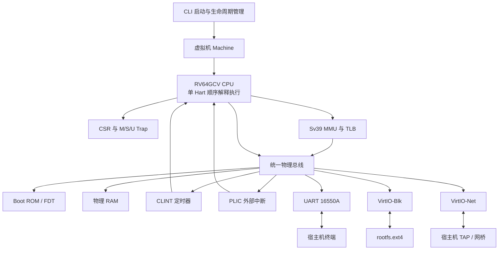

# homemade-risc-v-64-vector-linux-emulator

> **Disclaimer:** This is an independent, non-official, and purely educational project built entirely from scratch. It is not affiliated with, endorsed by, or connected to RISC-V International.

This project is a homemade, from-scratch 64-bit RISC-V full-system emulator with Vector (V) extension support. It provides an RV64GCV machine capable of booting OpenSBI and Linux, attaching an ext4 root filesystem, and connecting the guest to a host TAP network interface.

## 中文免责声明

本项目是完全从零开始、独立开发的非官方教育项目，仅用于学习和研究。项目与 RISC-V International 不存在隶属、认可、授权或其他关联关系。RISC-V 名称及相关标识的权利归其各自权利人所有。

## 项目概述

`homemade-risc-v-64-vector-linux-emulator` 是一个纯命令行、无 GUI、从零实现的 64 位 RISC-V 全系统模拟器。项目以现代 C++ 编写，通过软件模拟处理器、内存管理单元、中断控制器和必要的虚拟外设，形成一台能够运行 OpenSBI 与 Linux 的精简 RV64GCV 计算机。

README 描述项目的最终交付形态和使用方式。实际开发状态、验收证据及尚未完成的工作独立记录在 `specs/tasks.md`，README 不代替任务清单，也不驱动任务勾选。

## 最终能力

- 实现单 Hart、顺序执行、非流水线的 RV64GCV 指令级模拟器。
- 提供 32 个 64 位整数寄存器、32 个 64 位浮点寄存器，以及 32 个 VLEN=256 位的向量寄存器。
- 支持 RV64I、M、A、F、D、C 和 RVV 1.0 指令扩展；未定义编码产生精确的非法指令异常。
- 支持 M、S、U 三种特权级，以及 CSR、异常、中断、Trap 委托、`MRET` 和 `SRET` 状态转换。
- 支持 Sv39 三级页表、页权限检查、超级页、PTE A/D 位原子更新、至少 64 项 TLB 和 `SFENCE.VMA` 失效。
- 通过统一小端物理总线连接 RAM、Boot ROM、CLINT、PLIC、UART 16550A 和 VirtIO MMIO 设备。
- 通过 VirtIO-Blk 挂载 `rootfs.ext4`，通过 VirtIO-Net 与宿主机 TAP 接口交换以太网帧。
- 使用宿主机终端 Raw 模式提供 Linux 串口控制台，并可靠恢复终端状态。
- 从 OpenSBI 引导 Linux，进入交互式 Shell，并通过独立访客 IP 访问网络。

## 系统架构



CPU 的取指、普通数据访问、页表漫游和 DMA 均经过统一物理总线。RAM 与 MMIO 设备共享同一套地址路由和错误模型，避免形成绕过权限、边界检查或设备语义的第二条访问路径。

## 模拟硬件

| 组件 | 物理地址范围 | 最终职责 |
| --- | --- | --- |
| Boot ROM | `0x00001000`–`0x0000BFFF` | 保存启动跳板和扁平设备树 FDT |
| CLINT | `0x02000000`–`0x0200BFFF` | 提供 `mtime`、`mtimecmp` 和机器定时器中断 |
| PLIC | `0x0C000000`–`0x0FFFFFFF` | 仲裁 UART、块设备和网卡外部中断 |
| UART 16550A | `0x10000000`–`0x100000FF` | 映射宿主机标准输入输出，提供串口控制台 |
| VirtIO-Blk | `0x10001000`–`0x10001FFF` | 通过 Split Virtqueue 访问 ext4 磁盘镜像 |
| VirtIO-Net | `0x10002000`–`0x10002FFF` | 通过 Split Virtqueue 与 TAP 转发以太网帧 |
| RAM | `0x80000000` 起 | 装载 OpenSBI、Linux，并承载访客物理内存 |

## 指令与向量模型

标量执行引擎覆盖 RV64I 基础指令以及 M、A、F、D、C 扩展。取指器先读取 16 位半字并检查低两位，以区分 16 位压缩指令和 32 位标准指令，因此能够处理非 4 字节对齐的合法指令流。

RVV 1.0 引擎采用固定 `VLEN=256`，支持 `SEW=8/16/32/64` 与 LMUL 分组、`vl`/`vtype`/`vlenb` CSR、向量整数及浮点运算、Unit-strided 与 Strided 访存，以及基于 `v0` 的掩码执行。`vlenb` 固定返回 32。

## 构建

构建需要支持 C++17 的编译器、CMake 3.20 或更高版本，以及 Linux 提供的 TUN/TAP 接口。模拟器核心不依赖 GUI 或庞大的外围运行库。

```bash
cmake -S . -B build -DCMAKE_BUILD_TYPE=Debug
cmake --build build --parallel
ctest --test-dir build --output-on-failure
```

可选的 AddressSanitizer 与 UndefinedBehaviorSanitizer 构建：

```bash
cmake -S . -B build/sanitize \
  -DCMAKE_BUILD_TYPE=Debug \
  -DCMAKE_CXX_FLAGS=-fsanitize=address,undefined \
  -DCMAKE_EXE_LINKER_FLAGS=-fsanitize=address,undefined
cmake --build build/sanitize --parallel
ctest --test-dir build/sanitize --output-on-failure
```

`build/`、固件、内核、根文件系统镜像和本机网络配置均由 `.gitignore` 排除，不作为仓库源码提交。

## 准备运行资源

将下列外部构建产物放入本地工作目录；它们分别遵循各自项目的许可证，不属于本仓库源码：

- `opensbi.bin`：适用于本机内存布局的 OpenSBI 固件。
- `vmlinux.bin`：启用 RV64GC/VirtIO/UART 的精简 Linux 内核镜像。
- `rootfs.ext4`：包含启动脚本、Shell 和网络工具的 ext4 根文件系统。
- `tap0`：已连接网桥或配置 NAT 转发的宿主机 TAP 接口。

## 启动 Linux

使用一条命令启动完整虚拟机：

```bash
./build/riscv_vector_emulator \
  --bios opensbi.bin \
  --kernel vmlinux.bin \
  --disk rootfs.ext4 \
  --net tap0
```

启动器会校验输入文件和地址布局，生成或装载 FDT，初始化 RAM 与 MMIO 设备，将宿主机终端切换到 Raw 模式，然后从 Boot ROM 进入 OpenSBI。正常关机、显式退出或异常路径都会恢复原始终端属性。

## Linux 与网络验收

最终端到端验收依次观察到 OpenSBI Banner、Linux 内核日志和可交互 Shell。进入访客系统后配置网卡并验证 DNS 与公网连通性：

```bash
dhclient eth0
ip address show dev eth0
ping -c 4 google.com
```

验收通过时，`eth0` 获得独立地址，域名能够解析，并收到 4 个 ICMP Echo Reply。网络是否真正可达仍取决于宿主机 TAP、网桥/NAT、防火墙、DNS 和上游网络配置。

## 测试策略

测试直接驱动正式的 CPU、总线、MMU 和设备实现，不维护与生产代码平行的模拟逻辑。验证范围包括：

- 指令编码边界、寄存器别名、溢出、非对齐访问和精确异常。
- M/S/U 特权转换、CSR 别名、Trap 委托和中断优先级。
- Sv39 各级页表、超级页权限、TLB 失效与 A/D 位原子更新。
- Virtqueue 描述符链、索引回绕、坏链拒绝及 Used Ring 发布顺序。
- OpenSBI、Linux、块设备、串口和 TAP 网络的端到端集成路径。
- 严格编译告警、CTest、ASan 与 UBSan 动态检查。

任何测试完成并不自动改变任务状态；只有满足对应验收条件并保存证据后，才允许更新 `specs/tasks.md`。

## 规格与维护入口

规格入口见 `specs/README.md`，项目操作规则见 `AGENTS.md`，不可违反的工程原则见 `specs/constitution.md`。所有仓库内链接、命令和持久化配置均使用项目根目录相对路径。

其他重要入口：

- `docs/third-party.md`：第三方工具、固件、内核和根文件系统的用途、官方来源及安装说明。
- `docs/quickstart.md`：从准备环境到启动 Linux、验证串口与网络的最短完整路径。
- `specs/tasks.md`：真实任务状态、验收条件和验证证据的唯一进度入口。
- `specs/standards-baseline.md`：RISC-V、RVV 和 VirtIO 标准版本。
- `specs/project-tree.md`：目标目录与模块职责。
- `docs-site/specs/`：MkDocs 与 GitHub Pages 项目化 PRD。

## License

项目采用 MIT License，详见 `LICENSE`。OpenSBI、Linux、rootfs、工具链及其他第三方资源继续适用各自许可证，并且不会作为二进制产物提交到本仓库。
