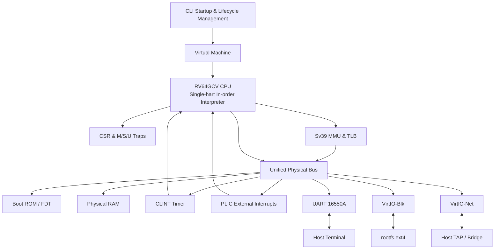

# homemade-risc-v-64-vector-linux-emulator

> **Disclaimer:** This is an independent, non-official, and purely educational project built entirely from scratch. It is not affiliated with, endorsed by, or connected to RISC-V International.

This project is a homemade, from-scratch 64-bit RISC-V full-system emulator with Vector (V) extension support. It provides an RV64GCV machine capable of booting OpenSBI and Linux, attaching an ext4 root filesystem, and connecting the guest to a host TAP network interface.

## Project Overview

`homemade-risc-v-64-vector-linux-emulator` is a pure CLI, GUI-less, 64-bit RISC-V full-system emulator implemented entirely from scratch. Written in modern C++, it emulates the processor, MMU, interrupt controllers, and essential virtual peripherals to form a minimal RV64GCV computer capable of booting OpenSBI and Linux.

- **Online Documentation Site (MkDocs)**: [https://billzi2016.github.io/homemade-risc-v-64-vector-linux-emulator/](https://billzi2016.github.io/homemade-risc-v-64-vector-linux-emulator/)
- **Codebase Metrics**: 130 source files containing **35,167 lines** of code (C++ 18,808 lines, Makefile 6,684 lines, YAML/YML 6,290 lines, HPP 2,944 lines, Shell 281 lines, Python 85 lines, C/H 75 lines).

The README describes the final delivery form and usage of the project. Current development status, acceptance evidence, and pending tasks are tracked independently in `specs/tasks.md`. The README does not substitute for the task list or drive task completion.

## Target Capabilities

- Implement a single-hart, sequential, non-pipelined RV64GCV instruction set emulator.
- Provide 32 64-bit integer registers, 32 64-bit floating-point registers, and 32 vector registers with fixed VLEN=256 bits.
- Support RV64I, M, A, F, D, C, and RVV 1.0 instruction extensions; undefined encodings trigger precise illegal instruction exceptions.
- Support M, S, and U privilege modes, CSRs, exceptions, interrupts, trap delegation, `MRET`, and `SRET` state transitions.
- Support Sv39 three-level page tables, page permission checks, superpages, atomic PTE A/D bit updates, a TLB with at least 64 entries, and `SFENCE.VMA` invalidation.
- Connect RAM, Boot ROM, CLINT, PLIC, UART 16550A, and VirtIO MMIO devices via a unified little-endian physical bus.
- Mount `rootfs.ext4` via VirtIO-Blk; host Linux can exchange Ethernet frames with guest via VirtIO-Net and TAP interface, while host macOS can boot in non-networked mode.
- Use host terminal Raw mode to provide a Linux serial console with reliable terminal state restoration.
- Boot Linux from OpenSBI into an interactive shell; the full Linux profile accesses external networks via a dedicated guest IP address.

## System Architecture



CPU instruction fetches, normal data accesses, page table walks, and DMA all pass through the unified physical bus. RAM and MMIO devices share the same address routing and error model to avoid creating secondary access paths that bypass permissions, boundary checks, or device semantics.

### System Architecture & Emulator C++ Source Code Mapping

| Booting Phase & Mechanism | MMIO / CSR Address | Emulator C++ Source File | Key Logic & Class Responsibility |
| --- | --- | --- | --- |
| **Boot ROM Reset** | `0x00001000` | `src/memory/boot_rom.cpp` | `BootRom`: Read-only init code loading, write-protection & sealing |
| **OpenSBI Firmware Loading** | `0x80000000` (RAM) | `src/runtime/boot.cpp` | `load_boot_images()`: Safe binary loading, initializes `PC=0x80000000` |
| **FDT Placement** | `0x82200000` (RAM) | `src/runtime/fdt.cpp` | `FdtBuilder`: Generates DTB nodes, passes DTB base address in `a1` |
| **Sv39 MMU Page Walk** | `satp` CSR | `src/memory/mmu.cpp` | `Mmu`: 3-level page table walk, TLB flushing, atomic A/D bit updates |
| **RVV 1.0 Vector Engine** | `vtype`, `vl` CSRs | `src/vector/vector_state.cpp` | `VectorState`: 32x256-bit vector register state & `mstatus.VS` maintenance |
| **CLINT Timer Interrupt** | `0x02000000` | `src/devices/clint.cpp` | `Clint`: `mtime` vs `mtimecmp` comparison, drives MTIP timer interrupts |
| **PLIC Interrupt Controller** | `0x0C000000` | `src/devices/plic.cpp` | `Plic`: 31 external interrupt priority arbitration & Claim/Complete |
| **UART 16550A Serial** | `0x10000000` | `src/devices/uart16550.cpp` | `Uart16550`: 8-bit MMIO registers, RBR/THR FIFOs & terminal bridge |
| **VirtIO-Blk Device** | `0x10001000` | `src/devices/virtio_block.cpp` | `VirtioBlock`: 512-byte sector DMA I/O & Virtqueue descriptor chain parsing |
| **VirtIO-Net NIC** | `0x10002000` | `src/devices/virtio_mmio.cpp` | `VirtioMmio`: VirtIO 1.0 state machine, RX/TX queues & TAP forwarding |
| **Host Terminal Raw Mode** | Host PTY | `src/platform/terminal.cpp` | `TerminalBackend`: Host `termios` raw mode toggling & `O_NONBLOCK` I/O |
| **Single-Hart Event Loop** | Cpu & Devices | `src/runtime/event_loop.cpp` | `EventLoop`: Instruction step, interrupt checks, & device ticks |

## Emulated Hardware

| Component | Physical Address Range | Primary Responsibility |
| --- | --- | --- |
| Boot ROM | `0x00001000`–`0x0000BFFF` | Stores boot jump trampoline and Flattened Device Tree (FDT) |
| CLINT | `0x02000000`–`0x0200BFFF` | Provides `mtime`, `mtimecmp`, and machine timer interrupts |
| PLIC | `0x0C000000`–`0x0FFFFFFF` | Arbitrates external interrupts for UART, block device, and NIC |
| UART 16550A | `0x10000000`–`0x100000FF` | Maps host standard I/O to provide a serial console |
| VirtIO-Blk | `0x10001000`–`0x10001FFF` | Accesses ext4 disk image via Split Virtqueues |
| VirtIO-Net | `0x10002000`–`0x10002FFF` | Forwards Ethernet frames via Split Virtqueues and TAP interface |
| RAM | Starting at `0x80000000` | Loads OpenSBI, Linux, and holds guest physical memory |

## Instruction and Vector Model

The scalar execution engine covers RV64I base instructions and M, A, F, D, C extensions. The fetch unit reads a 16-bit halfword first and checks the lower two bits to distinguish between 16-bit compressed instructions and 32-bit standard instructions, handling instruction streams aligned on 2-byte boundaries.

The RVV 1.0 engine uses a fixed `VLEN=256`, supporting `SEW=8/16/32/64` with LMUL grouping, `vl`/`vtype`/`vlenb` CSRs, vector integer and floating-point operations, unit-strided and strided memory accesses, and `v0`-based masked execution. `vlenb` statically returns 32.

## Building

Building requires a C++17 compliant compiler and CMake 3.20 or higher. The core emulator does not depend on GUI or heavy external libraries; only the Linux networking profile requires TUN/TAP.

```bash
cmake -S . -B build -DCMAKE_BUILD_TYPE=Debug
cmake --build build --parallel
ctest --test-dir build --output-on-failure
```

Optional AddressSanitizer and UndefinedBehaviorSanitizer builds:

```bash
cmake -S . -B build/sanitize \
  -DCMAKE_BUILD_TYPE=Debug \
  -DCMAKE_CXX_FLAGS=-fsanitize=address,undefined \
  -DCMAKE_EXE_LINKER_FLAGS=-fsanitize=address,undefined
cmake --build build/sanitize --parallel
ctest --test-dir build/sanitize --output-on-failure
```

`build/`, firmware, kernel, rootfs images, and host network configurations are excluded by `.gitignore` and are not committed to the repository.

## Preparing Execution Resources

Place the following external build artifacts into your local working directory; they follow their respective project licenses and are not repository source code:

- `artifacts/firmware/fw_jump.bin`: OpenSBI firmware compiled for our memory layout.
- `artifacts/kernel/Image`: Linux kernel image with RV64GC/VirtIO/UART enabled.
- `artifacts/disk/rootfs.ext4`: ext4 root filesystem containing boot scripts, shell, and networking tools.
- `tap0`: Host TAP interface connected to a bridge or NAT (required only for Linux networking profile).

## Booting Linux

On macOS or when host networking is not needed, boot in explicit non-networked mode:

```bash
./build/riscv_vector_emulator \
  --bios artifacts/firmware/fw_jump.bin \
  --kernel artifacts/kernel/Image \
  --disk artifacts/disk/rootfs.ext4 \
  --net none
```

For full Linux networking profile:

```bash
./build/riscv_vector_emulator \
  --bios artifacts/firmware/fw_jump.bin \
  --kernel artifacts/kernel/Image \
  --disk artifacts/disk/rootfs.ext4 \
  --net tap0
```

The launcher validates input files and address layouts, generates or loads FDT, initializes RAM and MMIO devices, opens the network backend only when TAP is selected, switches the terminal to Raw mode, and enters OpenSBI from Boot ROM. Normal shutdown, explicit exit, or error paths all restore original terminal settings.

## Refreshing Logs

Run from the repository root:

```bash
./run_all_logs.sh
```

The script overwrites `artifacts/logs/build.log`, `artifacts/logs/ctest.log`, and `artifacts/logs/linux-boot-uart.log`. To refresh diagnostic boot logs simultaneously:

```bash
RUN_DEBUG_BOOT=1 ./run_all_logs.sh
```

`BOOT_SECONDS=900` can adjust the single Linux boot recording window; the script writes exclusively to fixed log files under `artifacts/logs/`.

## Linux and Host Profile Acceptance

Both host profiles must sequentially observe the OpenSBI Banner, Linux kernel logs, ext4 root filesystem mount, and interactive shell. On macOS non-networked profile, execute in guest shell:

```bash
ls /
pwd
cat /proc/cpuinfo
```

On Linux networking profile, configure network interface and verify DNS and external connectivity:

```bash
dhclient eth0
ip address show dev eth0
ping -c 4 google.com
```

The macOS profile passes when the three basic commands execute successfully in the real guest shell; it does not claim networking capabilities. The Linux networking profile passes when `eth0` acquires an IP address, domain names resolve, and 4 ICMP Echo Replies are received.

## Testing Strategy

Tests directly exercise production CPU, bus, MMU, and device implementations without maintaining parallel emulation logic. Verification covers:

- Instruction encoding boundaries, register aliasing, overflow, unaligned access, and precise exceptions.
- M/S/U privilege transitions, CSR aliasing, trap delegation, and interrupt priorities.
- Sv39 page table levels, superpage permissions, TLB invalidation, and atomic A/D bit updates.
- Virtqueue descriptor chains, index wraparound, bad chain rejection, and Used Ring publication ordering.
- End-to-end integration paths across OpenSBI, Linux, block device, serial port, and TAP network.
- Strict compilation warnings, CTest, ASan, and UBSan dynamic checks.

Passing tests does not automatically update task status; `specs/tasks.md` can only be updated after meeting specific acceptance criteria and recording evidence.

## Specs and Maintenance References

Specification entry point is at `specs/README.md`, agent rules at `AGENTS.md`, and core principles at `specs/constitution.md`. All internal repository links, commands, and persisted configs use repository-relative paths.

Other key entries:

- [LINUX_BOOT_FLOW.md](LINUX_BOOT_FLOW.md): Verified boot flow evidence for OpenSBI, Linux, VirtIO-Blk, ext4 rootfs, and interactive shell.
- [linux-boot-flow-analysis.md](../docs/linux-boot-flow-analysis.md): Line-by-line technical analysis of Linux boot flow and console logs.
- [RESULT.md](../docs/RESULT.md): Build artifacts, SHA-256 hashes, file types, regression tests, and un-accepted status.
- [linux-runbook.md](../docs/linux-runbook.md): Buildroot builds, artifact copies, regression verification, and macOS `--net none` runbook.
- [third-party.md](../docs/third-party.md): Third-party tools, firmware, kernel, and rootfs purposes, official sources, and installation instructions.
- [quickstart.md](../docs/quickstart.md): Shortest complete path from environment setup to booting Linux and verifying console/networking.
- [tasks.md](../specs/tasks.md): Sole progress entry for real task status, acceptance conditions, and verification evidence.
- [standards-baseline.md](../specs/standards-baseline.md): RISC-V, RVV, and VirtIO standard versions.
- [project-tree.md](../specs/project-tree.md): Target directory and module responsibilities.
- `docs-site/specs/mkdocs_prd.md`: MkDocs and GitHub Pages project PRDs.

## License

This project is licensed under the MIT License - see `LICENSE` for details. OpenSBI, Linux, rootfs, toolchains, and third-party resources remain under their respective licenses and are not committed as binary artifacts to this repository.
