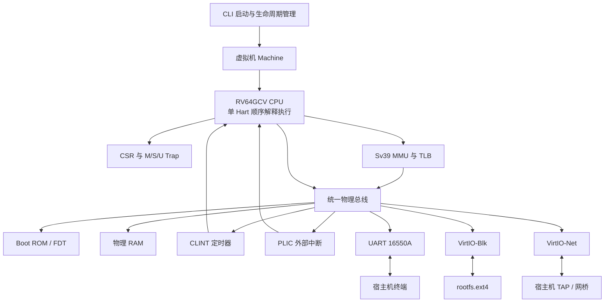

# homemade-risc-v-64-vector-linux-emulator

> **Disclaimer:** This is an independent, non-official, and purely educational project built entirely from scratch. It is not affiliated with, endorsed by, or connected to RISC-V International.

This project is a homemade, from-scratch 64-bit RISC-V full-system emulator with Vector (V) extension support. It provides an RV64GCV machine capable of booting OpenSBI and Linux, attaching an ext4 root filesystem, and connecting the guest to a host TAP network interface.

## 中文免责声明

本项目是完全从零开始、独立开发的非官方教育项目，仅用于学习和研究。项目与 RISC-V International 不存在隶属、认可、授权或其他关联关系。RISC-V 名称及相关标识的权利归其各自权利人所有。

## 项目概述

`homemade-risc-v-64-vector-linux-emulator` 是一个纯命令行、无 GUI、从零实现的 64 位 RISC-V 全系统模拟器。项目以现代 C++ 编写，通过软件模拟处理器、内存管理单元、中断控制器和必要的虚拟外设，形成一台能够运行 OpenSBI 与 Linux 的精简 RV64GCV 计算机。

- **在线文档站点 (MkDocs)**: [https://billzi2016.github.io/homemade-risc-v-64-vector-linux-emulator/](https://billzi2016.github.io/homemade-risc-v-64-vector-linux-emulator/)
- **代码规模统计**: 包含 130 个源码文件，共 **35,167 行** 代码（C++ 18,808 行，Makefile 6,684 行，YAML/YML 6,290 行，HPP 2,944 行，Shell 281 行，Python 85 行，C/H 75 行）。

README 描述项目的最终交付形态和使用方式。实际开发状态、验收证据及尚未完成的工作独立记录在 `specs/tasks.md`，README 不代替任务清单，也不驱动任务勾选。

## 最终能力

- 实现单 Hart、顺序执行、非流水线的 RV64GCV 指令级模拟器。
- 提供 32 个 64 位整数寄存器、32 个 64 位浮点寄存器，以及 32 个 VLEN=256 位的向量寄存器。
- 支持 RV64I、M、A、F、D、C 和 RVV 1.0 指令扩展；未定义编码产生精确的非法指令异常。
- 支持 M、S、U 三种特权级，以及 CSR、异常、中断、Trap 委托、`MRET` 和 `SRET` 状态转换。
- 支持 Sv39 三级页表、页权限检查、超级页、PTE A/D 位原子更新、至少 64 项 TLB 和 `SFENCE.VMA` 失效。
- 通过统一小端物理总线连接 RAM、Boot ROM、CLINT、PLIC、UART 16550A 和 VirtIO MMIO 设备。
- 通过 VirtIO-Blk 挂载 `rootfs.ext4`；Linux 宿主可通过 VirtIO-Net 与 TAP 接口交换以太网帧，macOS 可关闭网络启动。
- 使用宿主机终端 Raw 模式提供 Linux 串口控制台，并可靠恢复终端状态。
- 从 OpenSBI 引导 Linux 并进入交互式 Shell；Linux 完整档位还通过独立访客 IP 访问网络。

## 系统架构



CPU 的取指、普通数据访问、页表漫游和 DMA 均经过统一物理总线。RAM 与 MMIO 设备共享同一套地址路由和错误模型，避免形成绕过权限、边界检查或设备语义的第二条访问路径。

### 体系结构与模拟器 C++ 源码实现映射

| 引导阶段与硬件机制 | 对应物理 MMIO / CSR | 模拟器 C++ 源码实现文件 | 关键逻辑与类职责说明 |
| --- | --- | --- | --- |
| **Boot ROM 复位** | `0x00001000` | `src/memory/boot_rom.cpp` | `BootRom` 类：只读初始化指令装载，写保护与密封检查 |
| **OpenSBI 固件装载** | `0x80000000` (RAM) | `src/runtime/boot.cpp` | `load_boot_images()`：安全装载二进制，初始化 `PC=0x80000000` |
| **FDT 设备树放置** | `0x82200000` (RAM) | `src/runtime/fdt.cpp` | `FdtBuilder` 类：生成设备节点，向 `a1` 寄存器传递 DTB 地址 |
| **Sv39 MMU 页表漫游** | `satp` CSR | `src/memory/mmu.cpp` | `Mmu` 类：三级页表漫游、TLB 缓存刷新、A/D 位原子更新 |
| **RVV 1.0 向量引擎** | `vtype`, `vl` CSR | `src/vector/vector_state.cpp` | `VectorState` 类：32×256 位向量寄存器管理与 `mstatus.VS` 维护 |
| **CLINT 计时器中断** | `0x02000000` | `src/devices/clint.cpp` | `Clint` 类：`mtime` 与 `mtimecmp` 比较，驱动 MTIP 定时器中断 |
| **PLIC 中断控制器** | `0x0C000000` | `src/devices/plic.cpp` | `Plic` 类：31 个外部中断优先级仲裁、Claim/Complete 机制 |
| **UART 16550A 串口** | `0x10000000` | `src/devices/uart16550.cpp` | `Uart16550` 类：8 位 MMIO 寄存器，RBR/THR FIFO 与终端对接 |
| **VirtIO-Blk 块设备** | `0x10001000` | `src/devices/virtio_block.cpp` | `VirtioBlock` 类：512 字节扇区 DMA 读写与 Virtqueue 描述符链解析 |
| **VirtIO-Net 虚拟网卡** | `0x10002000` | `src/devices/virtio_mmio.cpp` | `VirtioMmio` 类：VirtIO 1.0 状态机协商、RX/TX 队列与 TAP 转发 |
| **宿主终端 Raw 模式** | Host PTY | `src/platform/terminal.cpp` | `TerminalBackend` 类：宿主 `termios` 切换与还原，`O_NONBLOCK` I/O |
| **单 HART 主事件循环** | Cpu & Devices | `src/runtime/event_loop.cpp` | `EventLoop` 类：指令 Step、中断检查、设备 Tick 统一事件推进 |

## 模拟硬件

| 组件 | 物理地址范围 | 最终职责 |
| --- | --- | --- |
| Boot ROM | `0x00001000`–`0x0000BFFF` | 保存启动跳板和扁平设备树 FDT |
| CLINT | `0x02000000`–`0x0200BFFF` | 提供 `mtime`、`mtimecmp` 和机器定时器中断 |
| PLIC | `0x0C000000`–`0x0FFFFFFF` | 仲裁 UART、块设备和网卡外部中断 |
| UART 16550A | `0x10000000`–`0x100000FF` | 映射宿主机标准输入输出，提供串口控制台 |
| VirtIO-Blk | `0x10001000`–`0x10001FFF` | 通过 Split Virtqueue 访问 ext4 磁盘镜像 |
| VirtIO-Net | `0x10002000`–`0x10002FFF` | 通过 Split Virtqueue 与 TAP 转发以太网帧 |
| RAM | `0x80000000` 起 | 装载 OpenSBI、Linux，并承载访客物理内存 |

## 指令与向量模型

标量执行引擎覆盖 RV64I 基础指令以及 M、A、F、D、C 扩展。取指器先读取 16 位半字并检查低两位，以区分 16 位压缩指令和 32 位标准指令，因此能够处理非 4 字节对齐的合法指令流。

RVV 1.0 引擎采用固定 `VLEN=256`，支持 `SEW=8/16/32/64` 与 LMUL 分组、`vl`/`vtype`/`vlenb` CSR、向量整数及浮点运算、Unit-strided 与 Strided 访存，以及基于 `v0` 的掩码执行。`vlenb` 固定返回 32。

## 构建

构建需要支持 C++17 的编译器和 CMake 3.20 或更高版本。模拟器核心不依赖 GUI 或庞大的外围运行库；只有 Linux 网络档位需要 TUN/TAP。

```bash
cmake -S . -B build -DCMAKE_BUILD_TYPE=Debug
cmake --build build --parallel
ctest --test-dir build --output-on-failure
```

可选的 AddressSanitizer 与 UndefinedBehaviorSanitizer 构建：

```bash
cmake -S . -B build/sanitize \
  -DCMAKE_BUILD_TYPE=Debug \
  -DCMAKE_CXX_FLAGS=-fsanitize=address,undefined \
  -DCMAKE_EXE_LINKER_FLAGS=-fsanitize=address,undefined
cmake --build build/sanitize --parallel
ctest --test-dir build/sanitize --output-on-failure
```

`build/`、固件、内核、根文件系统镜像和本机网络配置均由 `.gitignore` 排除，不作为仓库源码提交。

## 准备运行资源

将下列外部构建产物放入本地工作目录；它们分别遵循各自项目的许可证，不属于本仓库源码：

- `artifacts/firmware/fw_jump.bin`：适用于本机内存布局的 OpenSBI 固件。
- `artifacts/kernel/Image`：启用 RV64GC/VirtIO/UART 的 Linux 内核镜像。
- `artifacts/disk/rootfs.ext4`：包含启动脚本、Shell 和网络工具的 ext4 根文件系统。
- `tap0`：仅 Linux 网络档位需要的、已连接网桥或配置 NAT 转发的宿主机 TAP 接口。

## 启动 Linux

macOS 或不需要宿主网络时，以明确的无网络档位启动：

```bash
./build/riscv_vector_emulator \
  --bios artifacts/firmware/fw_jump.bin \
  --kernel artifacts/kernel/Image \
  --disk artifacts/disk/rootfs.ext4 \
  --net none
```

Linux 完整网络档位使用：

```bash
./build/riscv_vector_emulator \
  --bios artifacts/firmware/fw_jump.bin \
  --kernel artifacts/kernel/Image \
  --disk artifacts/disk/rootfs.ext4 \
  --net tap0
```

启动器会校验输入文件和地址布局，生成或装载 FDT，初始化 RAM 与 MMIO 设备，并仅在选择 TAP 时打开网络后端；随后切换终端 Raw 模式并从 Boot ROM 进入 OpenSBI。正常关机、显式退出或异常路径都会恢复原始终端属性。

## 刷新日志

从仓库根目录执行：

```bash
./run_all_logs.sh
```

脚本固定覆盖 `artifacts/logs/build.log`、`artifacts/logs/ctest.log` 和 `artifacts/logs/linux-boot-uart.log`。需要同时刷新诊断启动日志时执行：

```bash
RUN_DEBUG_BOOT=1 ./run_all_logs.sh
```

可用 `BOOT_SECONDS=900` 调整单次 Linux 启动记录窗口；脚本只写 `artifacts/logs/` 下的固定日志文件。

## Linux 与宿主档位验收

两个宿主档位都必须依次观察到 OpenSBI Banner、Linux 内核日志、ext4 根文件系统和可交互 Shell。macOS 无网络档位在来宾中执行：

```bash
ls /
pwd
cat /proc/cpuinfo
```

Linux 网络档位继续配置网卡并验证 DNS 与公网连通性：

```bash
dhclient eth0
ip address show dev eth0
ping -c 4 google.com
```

macOS 档位通过条件是三条基础命令由真实来宾 Shell 执行成功；它不宣称网络能力。Linux 网络档位通过时，`eth0` 获得独立地址，域名能够解析，并收到 4 个 ICMP Echo Reply。

## 测试策略

测试直接驱动正式的 CPU、总线、MMU 和设备实现，不维护与生产代码平行的模拟逻辑。验证范围包括：

- 指令编码边界、寄存器别名、溢出、非对齐访问和精确异常。
- M/S/U 特权转换、CSR 别名、Trap 委托和中断优先级。
- Sv39 各级页表、超级页权限、TLB 失效与 A/D 位原子更新。
- Virtqueue 描述符链、索引回绕、坏链拒绝及 Used Ring 发布顺序。
- OpenSBI、Linux、块设备、串口和 TAP 网络的端到端集成路径。
- 严格编译告警、CTest、ASan 与 UBSan 动态检查。

任何测试完成并不自动改变任务状态；只有满足对应验收条件并保存证据后，才允许更新 `specs/tasks.md`。

## 规格与维护入口

规格入口见 `specs/README.md`，项目操作规则见 `AGENTS.md`，不可违反的工程原则见 `specs/constitution.md`。所有仓库内链接、命令和持久化配置均使用项目根目录相对路径。

其他重要入口：

- [LINUX_BOOT_FLOW.zh.md](LINUX_BOOT_FLOW.zh.md)：OpenSBI、Linux、VirtIO-Blk、ext4 rootfs 和 Shell 的真实启动 flow 证据。
- [linux-boot-flow-analysis.zh.md](../docs/linux-boot-flow-analysis.zh.md)：Linux 引导日志与全系统 Flow 的逐行深度解析。
- [RESULT.zh.md](../docs/RESULT.zh.md)：构建产物、SHA-256、文件类型、回归测试和未完成验收状态。
- [linux-runbook.zh.md](../docs/linux-runbook.zh.md)：Buildroot 构建、产物复制、回归验证和 macOS `--net none` 运行手册。
- [third-party.zh.md](../docs/third-party.zh.md)：第三方工具、固件、内核和根文件系统的用途、官方来源及安装说明。
- [quickstart.zh.md](../docs/quickstart.zh.md)：从准备环境到启动 Linux、验证串口与网络的最短完整路径。
- [specs/tasks.zh.md](../specs/tasks.zh.md)：真实任务状态、验收条件和验证证据的唯一进度入口。
- [specs/standards-baseline.zh.md](../specs/standards-baseline.zh.md)：RISC-V、RVV 和 VirtIO 标准版本。
- [specs/project-tree.zh.md](../specs/project-tree.zh.md)：目标目录与模块职责。
- `docs-site/specs/mkdocs_prd.zh.md`：MkDocs 与 GitHub Pages 项目化 PRD。

## License

项目采用 MIT License，详见 `LICENSE`。OpenSBI、Linux、rootfs、工具链及其他第三方资源继续适用各自许可证，并且不会作为二进制产物提交到本仓库。
