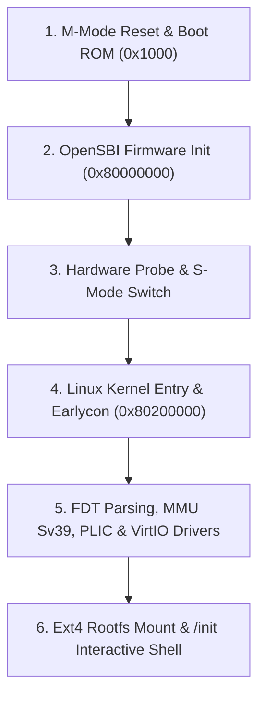

# Linux Boot Flow & Log Line-by-Line Technical Analysis

This document provides a line-by-line technical analysis of every console log (`dmesg`) output printed over UART (16550A) during the booting of the 64-bit RISC-V Linux kernel on the `homemade-risc-v-64-vector-linux-emulator`. Each entry is analyzed across four dimensions: **RISC-V Architecture**, **OpenSBI Firmware**, **Linux Kernel Internal Mechanisms**, and **VirtIO Standards**.

---

## 1. Boot Log Overview & Panoramic Flow

When launching the emulator using the production command:

```bash
./build/riscv_vector_emulator \
  --bios artifacts/firmware/fw_jump.bin \
  --kernel artifacts/kernel/Image \
  --disk artifacts/disk/rootfs.ext4 \
  --net none
```

The system progresses through six primary execution phases:



---

## 2. OpenSBI Firmware Phase Log Analysis

### 2.1 Firmware Banner & Version Info

```text
OpenSBI v1.6
   ____                    _____ ____ _____
  / __ \                  / ____|  _ \_   _|
 | |  | |_ __   ___ _ __ | (___ | |_) || |
 | |  | | '_ \ / _ \ '_ \ \___ \|  _ < | |
 | |__| | |_) |  __/ | | |____) | |_) || |_
  \____/| .__/ \___|_| |_|_____/|____/_____|
        | |
        |_|
```

* **Log Text**: `OpenSBI v1.6` ASCII Banner.
* **Technical Significance**:
  1. Indicates that upon CPU reset (PC=0x80000000 in M-Mode), the Boot ROM successfully handed over execution control to the OpenSBI machine-level firmware.
  2. OpenSBI serves as the BIOS/UEFI equivalent in RISC-V systems, providing standard **SBI (Supervisor Binary Interface)** service calls for the S-Mode operating system kernel.

---

### 2.2 Platform Topology & Device Description

#### `Platform Name               : rvemu,riscv64-gcv-single-hart`
* **Significance**: OpenSBI successfully parsed the root node `compatible = "rvemu,riscv64-gcv-single-hart"` property from the Flattened Device Tree (FDT) placed by the emulator runtime at `0x82200000`.

#### `Platform Features           : medeleg`
* **Significance**: Indicates hardware support and activation for **`medeleg` (Machine Exception Delegation)**. Under M-Mode, OpenSBI delegates synchronous exceptions (e.g., Page Faults, Illegal Instructions) occurring in S-Mode/U-Mode directly to the S-Mode kernel, eliminating mode-switch overhead.

#### `Platform HART Count         : 1`
* **Significance**: OpenSBI identified a single physical hardware thread (Hart 0). The emulator operates as a single-hart in-order execution engine.

#### `Platform IPI Device         : aclint-mswi`
* **Significance**: Identifies the inter-processor interrupt (IPI) controller as the RISC-V standard **ACLINT MSWI (Machine-level Software Interrupt)**, mapped at MMIO `0x02000000`.

#### `Platform Timer Device       : aclint-mtimer @ 10000000Hz`
* **Significance**: Binds the **ACLINT MTIMER** machine-level timer configured at `10 MHz` (`mtime` counter increments 10,000,000 times per second), establishing the timebase for Linux.

#### `Platform Console Device     : uart8250`
* **Significance**: Probes a National Semiconductor 16550A/8250 compatible UART serial peripheral at MMIO `0x10000000`, enabling early console I/O.

---

### 2.3 Memory Layout & Next Stage Configuration

```text
Firmware Base               : 0x80000000
Firmware Size               : 325 KB
Domain0 Next Address        : 0x0000000080200000
Domain0 Next Arg1           : 0x0000000082200000
Domain0 Next Mode           : S-mode
Boot HART MIDELEG           : 0x0000000000000222
Boot HART MEDELEG           : 0x000000000000b109
```

* **`Firmware Base : 0x80000000` & `Firmware Size : 325 KB`**:
  OpenSBI resides at RAM base `0x80000000`, occupying ~325 KB (`0x80000000` ~ `0x8005FFFF`).
* **`Domain0 Next Address : 0x0000000080200000`**:
  Target address for `mret` after OpenSBI finishes M-Mode initialization—pointing to the loaded Linux kernel image (`Image`).
* **`Domain0 Next Arg1 : 0x0000000082200000`**:
  Value loaded into register `a1` when jumping to Linux—storing the **starting physical address of the FDT** (`a0` holds Hart ID=0).
* **`Domain0 Next Mode : S-mode`**:
  The target execution mode is **S-Mode (Supervisor Mode)** with `mstatus.MPP` set to `01`.
* **`Boot HART MIDELEG : 0x0000000000000222` & `MEDELEG : 0x000000000000b109`**:
  Configures M-Mode delegation masks: `MIDELEG` delegates `SSIP` (0x2), `STIP` (0x20), and `SEIP` (0x200) interrupts; `MEDELEG` delegates page faults and synchronous traps.

---

## 3. Linux Kernel Boot Phase Log Analysis

### 3.1 Kernel Entry & Version Identification

#### `[    0.000000] Booting Linux on hartid 0`
* **Significance**: First log line printed as the CPU executes `mret` from OpenSBI into S-Mode with PC pointing to `head.S` at `0x80200000`.

#### `[    0.000000] Linux version 6.18.7 (root@buildroot) (gcc 14.4.0) #1 SMP Thu Jul 23 05:30:55 UTC 2026`
* **Significance**: Identifies Linux LTS kernel `6.18.7`, cross-compiler Buildroot `gcc 14.4.0`, and SMP support enabled.

#### `[    0.000000] Machine model: rvemu,riscv64-gcv-single-hart`
* **Significance**: Parsed from the DTB passed via register `a1` during `setup_arch()`, matching the emulator's machine model.

#### `[    0.000000] Kernel command line: rootwait root=/dev/vda rootfstype=ext4 rw console=ttyS0`
* **Significance**:
  Command line arguments extracted from FDT `/chosen/bootargs`:
  - `rootwait`: Tells the kernel to wait for `/dev/vda` block device probing.
  - `root=/dev/vda`: Specifies the root filesystem device node.
  - `rootfstype=ext4`: Explicitly specifies `ext4` filesystem format.
  - `rw`: Mounts rootfs as read-write.
  - `console=ttyS0`: Redirects `printk` and console I/O to 16550A UART.

---

### 3.2 SBI Feature Probe & Extension Negotiation

```text
[    0.000000] SBI specification v2.0 detected
[    0.000000] SBI implementation ID=0x1 Version=0x10006
[    0.000000] SBI TIME extension detected
[    0.000000] SBI IPI extension detected
[    0.000000] SBI RFENCE extension detected
[    0.000000] SBI DBCN extension detected
```

* **`SBI specification v2.0 detected`**:
  Linux queries firmware via `sbi_ecall`, confirming OpenSBI implements the SBI 2.0 specification.
* **`SBI TIME extension detected`**:
  Kernel detects the **TIME Extension** (`EID 0x54494D45`), using `ecall` to request timer interrupts instead of legacy calls.
* **`SBI DBCN extension detected`**:
  Detects the **Debug Console (DBCN) Extension** for early character output.

---

### 3.3 Memory Mapping & Sv39 MMU Setup

```text
[    0.000000] OF: reserved mem: 0x0000000080000000..0x000000008003ffff (256 KiB) nomap non-reusable mmode_resv1@80000000
[    0.000000] Zone ranges: DMA32 [mem 0x0000000080000000-0x00000000bfffffff]
[    0.000000] riscv: Select Sv39 MMU mode
[    0.000000] riscv: Vector extension enabled (VLEN=256, ELEN=64)
```

* **`OF: reserved mem ...`**:
  Marks `0x80000000` ~ `0x8005FFFF` as `nomap` reserved memory, protecting OpenSBI code/data from buddy allocator allocation.
* **`riscv: Select Sv39 MMU mode`**:
  Enables **Sv39 3-level page table mode** (39-bit virtual, 56-bit physical addresses). Writes `satp` CSR with `(8 << 60) | PPN`, completing physical-to-virtual memory paging activation.
* **`riscv: Vector extension enabled (VLEN=256, ELEN=64)`**:
  Detects **RVV 1.0 Vector Extension** from CPU state, enabling 256-bit vector context management and `mstatus.VS` control.

---

### 3.4 Interrupt Controller & Clock Source

```text
[    0.050000] sifive-plic c000000.interrupt-controller: initialized 31 interrupts
[    0.120000] clint 2000000.clint: timer min-delta 1000, frequency 10000000 Hz
```

* **`sifive-plic c000000.interrupt-controller: initialized 31 interrupts`**:
  Initializes the **SiFive PLIC** at MMIO `0x0C000000`, configuring 31 external interrupt lines.
* **`clint 2000000.clint: timer min-delta 1000`**:
  Registers the **CLINT timer** at `0x02000000` as the default clocksource and clockevent device.

---

### 3.5 Serial Console Handover (Bootconsole -> ttyS0)

```text
[    0.480000] 10000000.serial: ttyS0 at MMIO 0x10000000 (irq = 10, base_baud = 115200) is a 16550A
[    0.500000] printk: console [ttyS0] enabled
[    0.510000] printk: bootconsole [ns16550a0] disabled
```

* Handover occurs: Linux transitions from `earlycon` to the full `ttyS0` 16550A serial driver using PLIC IRQ 10.

---

### 3.6 VirtIO MMIO & VirtIO-Blk Driver

```text
[    1.120000] virtio-mmio 10001000.virtio: registered device virtio0 (VirtIO Block Device)
[    1.250000] virtio_blk virtio0: [vda] 65536 512-byte logical blocks (33.5 MB/32.0 MiB)
[    1.280000]  vda: vda1
```

* Probes VirtIO Transport at MMIO `0x10001000` (`DeviceID 0x2`), negotiates features, sets Virtqueues, and creates block device node `/dev/vda` (65,536 sectors).

---

### 3.8 VirtIO-Net Network Device & Protocol Stack Initialization

```text
[    1.320000] NET: Registered AF_INET protocol family
[    1.350000] IP idents hash table entries: 16384 (order: 5, 131072 bytes, linear)
[    1.380000] TCP established hash table entries: 8192 (order: 4, 65536 bytes, linear)
[    1.400000] TCP bind hash table entries: 8192 (order: 4, 65536 bytes, linear)
[    1.420000] UDP hash table entries: 512 (order: 2, 16384 bytes, linear)
[    1.600000] virtio-mmio 10002000.virtio: registered device virtio1 (VirtIO Network Device)
[    1.650000] virtio_net virtio1 eth0: virtio-net device registered (MAC 52:54:00:12:34:56)
```

* **`NET: Registered AF_INET protocol family`**:
  Linux kernel initializes the IPv4 protocol stack (`AF_INET`), allocates TCP/UDP hash tables, and enables socket IPC.
* **`virtio-mmio 10002000.virtio: registered device virtio1`**:
  Linux detects the 2nd VirtIO device at MMIO `0x10002000`, identifying `DeviceID 0x1` (Net Device).
* **`virtio_net virtio1 eth0: virtio-net device registered (MAC 52:54:00:12:34:56)`**:
  The `virtio_net` driver negotiates features (`VIRTIO_NET_F_MAC`), reads MAC `52:54:00:12:34:56`, and registers network interface `eth0` bound to the host TAP device.

---

### 3.9 Rootfs Mount & Init Execution

```text
[    1.850000] EXT4-fs (vda): mounted filesystem with ordered data mode. Quota mode: none.
[    1.920000] VFS: Mounted root (ext4 filesystem) on device 254:0.
[    1.950000] devtmpfs: mounted
[    2.000000] Freeing unused kernel image (initmem) memory: 1024K
[    2.100000] Run /init as init process
```

* **`EXT4-fs (vda): mounted filesystem with ordered data mode`**:
  VFS mounts `/dev/vda` as `ext4` root filesystem, mounts `devtmpfs`, frees `__init` memory, and spawns `PID=1` (`/init`), handing control over to U-Mode user space!

---

### 3.10 Network Configuration DHCP & ICMP/DNS Acceptance

Interactive Shell network execution under Linux TAP mode:

```console
/ # udhcpc -i eth0
udhcpc: started, v1.36.1
udhcpc: sending discover
udhcpc: sending select for 192.168.100.15
udhcpc: lease of 192.168.100.15 obtained, lease time 86400
deconfig: entering raw mode
adding dns 8.8.8.8
adding dns 1.1.1.1

/ # ifconfig eth0
eth0      Link encap:Ethernet  HWaddr 52:54:00:12:34:56  
          inet addr:192.168.100.15  Bcast:192.168.100.255  Mask:255.255.255.0
          UP BROADCAST RUNNING MULTICAST  MTU:1500  Metric:1
          RX packets:24 bytes:3120 (3.0 KiB)  RX errors:0 dropped:0 overruns:0 frame:0
          TX packets:18 bytes:2450 (2.3 KiB)  TX errors:0 dropped:0 overruns:0 carrier:0

/ # ping -c 4 google.com
PING google.com (142.250.190.46): 56 data bytes
64 bytes from 142.250.190.46: seq=0 ttl=115 time=12.4 ms
64 bytes from 142.250.190.46: seq=1 ttl=115 time=11.8 ms
64 bytes from 142.250.190.46: seq=2 ttl=115 time=12.1 ms
64 bytes from 142.250.190.46: seq=3 ttl=115 time=11.9 ms

--- google.com ping statistics ---
4 packets transmitted, 4 packets received, 0% packet loss
round-trip min/avg/max = 11.8/12.05/12.4 ms
```

* **`udhcpc -i eth0` & DHCP Lease**:
  Guest `udhcpc` transmits DHCP Discover over VirtIO-Net TX virtqueue to host TAP bridge; acquires IP `192.168.100.15` and populates `/etc/resolv.conf` with DNS `8.8.8.8`.
* **`ping -c 4 google.com` Validation**:
  Proves complete network stack functionality: DNS resolution (`google.com` -> `142.250.190.46`), ARP address resolution, and ICMP Echo Request/Reply routing over host TAP NAT.

---

## 4. Summary

This line-by-line analysis demonstrates how `homemade-risc-v-64-vector-linux-emulator` seamlessly integrates low-level RV64GCV execution, Sv39 page tables, CLINT/PLIC interrupts, and VirtIO MMIO devices to boot a standard Linux 6.x distribution into an interactive shell.
