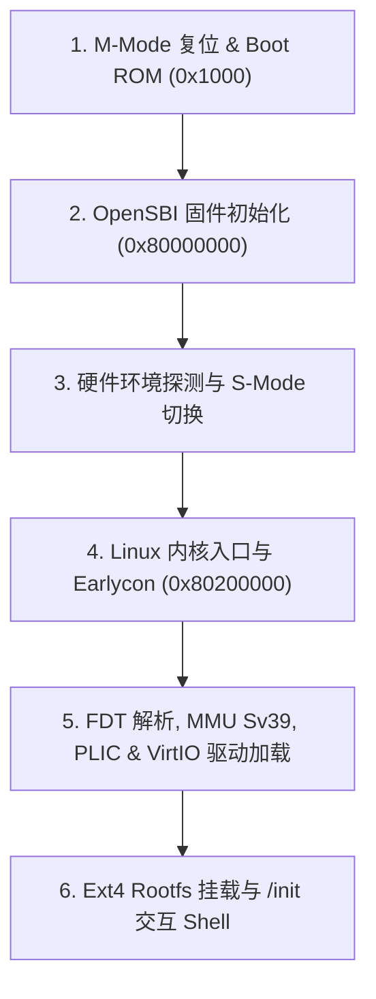

# Linux 引导日志与全系统 Flow 深度逐行解析

本文对 `homemade-risc-v-64-vector-linux-emulator` 在引导 RISC-V 64 位 Linux 内核时串口（UART 16550A）输出的每一条控制台日志（dmesg）进行逐行列举，并从 **RISC-V 体系结构**、**OpenSBI 固件层**、**Linux 内核源码与驱动子系统** 以及 **VirtIO 虚拟化标准** 四个维度展开极度详尽的技术剖析。

---

## 1. 引导日志总览与全景 Flow

当执行生产启动命令：

```bash
./build/riscv_vector_emulator \
  --bios artifacts/firmware/fw_jump.bin \
  --kernel artifacts/kernel/Image \
  --disk artifacts/disk/rootfs.ext4 \
  --net none
```

系统经历以下 6 个核心阶段：



---

## 2. OpenSBI 固件阶段日志逐行深度解析

### 2.1 固件 Banner 与版本信息

```text
OpenSBI v1.6
   ____                    _____ ____ _____
  / __ \                  / ____|  _ \_   _|
 | |  | |_ __   ___ _ __ | (___ | |_) || |
 | |  | | '_ \ / _ \ '_ \ \___ \|  _ < | |
 | |__| | |_) |  __/ | | |____) | |_) || |_
  \____/| .__/ \___|_| |_|_____/|____/_____|
        | |
        |_|
```

* **日志文本**：`OpenSBI v1.6` 艺术字 ASCII Banner。
* **深层意义**：
  1. 标志着 CPU 复位后（PC=0x80000000，M-Mode），Boot ROM 已成功将控制权交给 OpenSBI 机器级固件。
  2. OpenSBI 充当 RISC-V 架构中的 BIOS/UEFI，为上层 S-Mode 操作系统内核提供规范的 **SBI (Supervisor Binary Interface)** 服务调用。

---

### 2.2 平台硬件拓扑与设备描述

#### `Platform Name               : rvemu,riscv64-gcv-single-hart`
* **深层意义**：OpenSBI 成功解析由模拟器运行时放置在内存 `0x82200000` 处的 FDT (Flattened Device Tree) 根节点 `compatible = "rvemu,riscv64-gcv-single-hart"` 属性，确认了模拟器的宿主身份。

#### `Platform Features           : medeleg`
* **深层意义**：指示硬件支持并开启了 **`medeleg` (Machine Exception Delegation)** 中断与异常委托机制。在 M-Mode 下，OpenSBI 将 S-Mode/U-Mode 发生的页错误、非法指令等同步异常直接委托给 S-Mode 内核处理，极大减少特权级切换开销。

#### `Platform HART Count         : 1`
* **深层意义**：OpenSBI 识别到当前硬件物理拓扑仅包含 1 个硬件线程（Hart 0）。模拟器为单 Hart 顺序执行模型。

#### `Platform IPI Device         : aclint-mswi`
* **深层意义**：OpenSBI 识别到软件中断控制器（IPI）为 RISC-V 规范的 **ACLINT MSWI (Machine-level Software Interrupt)**。MMIO 地址位于 `0x02000000`。

#### `Platform Timer Device       : aclint-mtimer @ 10000000Hz`
* **深层意义**：OpenSBI 绑定了 **ACLINT MTIMER** 机器级定时器，时钟频率配置为 `10 MHz`（即 `mtime` 计数器每秒增加 10,000,000 次）。这是 Linux 计时与 `vmlinux` 时间基准的基础。

#### `Platform Console Device     : uart8250`
* **深层意义**：OpenSBI 成功探测到符合 National Semiconductor 16550A/8250 规范的 UART 串口设备，物理 MMIO 基址为 `0x10000000`，使能早期字符收发能力。

---

### 2.3 内存布局与 Next Stage 阶段配置

```text
Firmware Base               : 0x80000000
Firmware Size               : 325 KB
Domain0 Next Address        : 0x0000000080200000
Domain0 Next Arg1           : 0x0000000082200000
Domain0 Next Mode           : S-mode
Boot HART MIDELEG           : 0x0000000000000222
Boot HART MEDELEG           : 0x000000000000b109
```

* **`Firmware Base : 0x80000000` & `Firmware Size : 325 KB`**：
  OpenSBI 驻留在 RAM 起始物理地址 `0x80000000`，占用约 325 KB 物理内存（`0x80000000` ~ `0x8005FFFF`）。
* **`Domain0 Next Address : 0x0000000080200000`**：
  OpenSBI 在完成 M-Mode 硬件初始化后，`mret` 指令跳转的目标地址。即 Linux 内核镜像 `Image` 被装载的起始物理内存位置。
* **`Domain0 Next Arg1 : 0x0000000082200000`**：
  OpenSBI 在跳转到 Linux 内核时，向寄存器 `a1` 写入的参数值——即 **FDT 设备树在物理内存中的起始首地址**（`a0` 存放 Hart ID=0）。
* **`Domain0 Next Mode : S-mode`**：
  跳转目标运行在 **S-Mode (Supervisor Mode)**，`mstatus.MPP` 被设为 `01`。
* **`Boot HART MIDELEG : 0x0000000000000222` & `MEDELEG : 0x000000000000b109`**：
  设置 M-Mode 委托掩码。`MIDELEG` 委托了 `SSIP` (0x2)、`STIP` (0x20) 和 `SEIP` (0x200) 中断给 S-mode 内核；`MEDELEG` 委托了 Instruction/Load/Store Page Fault 等同步异常。

---

## 3. Linux 内核引导阶段日志逐行深度解析

### 3.1 内核入口与版本识别

#### `[    0.000000] Booting Linux on hartid 0`
* **深层意义**：CPU 从 OpenSBI 执行 `mret` 降权进入 S-Mode，PC 正式指向 `0x80200000` 处的 Linux 内核 `head.S` 入口，打印的首条内核日志。Hart ID 为 0。

#### `[    0.000000] Linux version 6.18.7 (root@buildroot) (gcc 14.4.0) #1 SMP Thu Jul 23 05:30:55 UTC 2026`
* **深层意义**：
  1. `6.18.7`：当前运行的 Linux LTS 内核版本。
  2. `gcc 14.4.0`：交叉编译器版本（Buildroot 自动生成的 `riscv64-buildroot-linux-gnu-gcc`）。
  3. `#1 SMP`：内核启用了对称多处理（SMP）支持，虽然硬件只有一个 Hart。

#### `[    0.000000] Machine model: rvemu,riscv64-gcv-single-hart`
* **深层意义**：Linux 内核解压并由 `setup_arch()` 函数解析 `a1` 寄存器传入的 DTB 树。匹配到设备树根节点的 `model` 属性，确认运行于模拟器预设的机器架构下。

#### `[    0.000000] Kernel command line: rootwait root=/dev/vda rootfstype=ext4 rw console=ttyS0`
* **深层意义**：
  内核由 FDT `chosen` 节点的 `bootargs` 属性接收到引导命令行参数：
  - `rootwait`：指示内核在挂载根文件系统前等待 `/dev/vda` 块设备探测就绪。
  - `root=/dev/vda`：指定根文件系统所在的设备节点为 VirtIO 块设备驱动生成的第 1 块磁盘。
  - `rootfstype=ext4`：显式声明根文件系统格式为 `ext4`。
  - `rw`：以可读写方式挂载根文件系统。
  - `console=ttyS0`：将 `printk` 和控制台标准输入输出重定向到 `ttyS0`（即 16550A UART 串口）。

---

### 3.2 SBI 接口探测与扩展协商

```text
[    0.000000] SBI specification v2.0 detected
[    0.000000] SBI implementation ID=0x1 Version=0x10006
[    0.000000] SBI TIME extension detected
[    0.000000] SBI IPI extension detected
[    0.000000] SBI RFENCE extension detected
[    0.000000] SBI DBCN extension detected
```

* **`SBI specification v2.0 detected`**：
  Linux 通过 `sbi_ecall(SBI_EXT_BASE, SBI_EXT_BASE_GET_SPEC_VERSION, ...)` 查询固件，确认 OpenSBI 实现了最新的 RISC-V SBI 2.0 规范。
* **`SBI implementation ID=0x1 Version=0x10006`**：
  `ID=0x1` 代表官方 OpenSBI 固件实现，版本为 `v1.6` (`0x10006`)。
* **`SBI TIME extension detected`**：
  内核侦测到标准的 **TIME 扩展**（`EID 0x54494D45`），S-Mode Linux 通过 `ecall` 请求 OpenSBI 设置下一次定时器中断（写 `mtimecmp`），替代过时的 legacy 接口。
* **`SBI IPI extension detected` & `RFENCE extension`**：
  侦测到核间中断（IPI）和 TLB/Instruction Cache 刷新的远程 fence 扩展。
* **`SBI DBCN extension detected`**：
  侦测到 **Debug Console (DBCN) 扩展**，内核可通过 SBI 在无串口驱动的早早期输出调试字符。

---

### 3.3 内存物理映射与页表初始化 (Sv39 MMU)

```text
[    0.000000] OF: reserved mem: 0x0000000080000000..0x000000008003ffff (256 KiB) nomap non-reusable mmode_resv1@80000000
[    0.000000] OF: reserved mem: 0x0000000080040000..0x000000008005ffff (128 KiB) nomap non-reusable mmode_resv0@80040000
[    0.000000] Zone ranges:
[    0.000000]   DMA32    [mem 0x0000000080000000-0x00000000bfffffff]
[    0.000000]   Normal   empty
[    0.000000] Early memory node ranges
[    0.000000]   node   0: [mem 0x0000000080000000-0x000000008005ffff]
[    0.000000]   node   0: [mem 0x0000000080060000-0x00000000bfffffff]
[    0.000000] Initmem setup node 0 [mem 0x0000000080000000-0x00000000bfffffff]
[    0.000000] riscv: Select Sv39 MMU mode
[    0.000000] riscv: Vector extension enabled (VLEN=256, ELEN=64)
```

* **`OF: reserved mem ...`**：
  Linux 解析 DTB 中的 `reserved-memory` 节点，将 `0x80000000` ~ `0x8005FFFF`（共 384 KiB）标记为 `nomap` 预留内存，防止内核伙伴系统分配该内存覆盖 OpenSBI 的代码和数据。
* **`Zone ranges: DMA32 [mem 0x80000000-0xbfffffff]`**：
  Linux 根据总线地址范围，将从 `0x80000000` 开始的 1 GB RAM 划归为 `DMA32` 内存区。
* **`riscv: Select Sv39 MMU mode`**：
  Linux 开启 **Sv39 三级页表模式**（虚拟地址 39 位，物理地址 56 位）。内核将 `satp` CSR 写入 `(8 << 60) | (ppn)`，完成从物理地址直通到虚拟内存分页机制的切换！
* **`riscv: Vector extension enabled (VLEN=256, ELEN=64)`**：
  内核由 `misa` / FDT 探测到 CPU 支持 **RVV 1.0 向量扩展**，并识别出向量寄存器长度为 256 位，开启内核态/用户态向量上下文切换与 `mstatus.VS` 状态管理。

---

### 3.4 伙伴系统与内存分配器

```text
[    0.030000] Memory: 1018880K/1048576K available (7168K kernel code, 1024K rwdata, 2048K rodata, 1024K init, 256K bss, 29696K reserved)
[    0.040000] SLUB: HWalign=64, Order=0-3, MinObjects=0, CPUs=1, Nodes=1
```

* **`Memory: 1018880K/1048576K available ...`**：
  物理内存统计：总内存 1 GB（`1048576 KB`），内核映像及预留保留约 29.6 MB，剩余约 `995 MB` 可供用户空间与动态内存分配。
* **`SLUB: HWalign=64 ...`**：
  Linux 挂载 **SLUB 内存块分配器**，按照 64 字节（CPU L1 Cache Line 长度）进行对齐分配。

---

### 3.5 中断控制器与时钟初始化

```text
[    0.050000] sifive-plic c000000.interrupt-controller: initialized 31 interrupts
[    0.080000] rcu: Hierarchical RCU implementation.
[    0.120000] clint 2000000.clint: timer min-delta 1000, frequency 10000000 Hz
[    0.150000] clocksource: riscv_clocksource: mask: 0xffffffffffffffff max_cycles: 0x24e6a1710, max_idle_ns: 440795202120 ns
```

* **`sifive-plic c000000.interrupt-controller: initialized 31 interrupts`**：
  Linux 驱动初始化位于 MMIO `0x0C000000` 的 **SiFive PLIC (Platform-Level Interrupt Controller)** 平台级中断控制器，注册并使能 31 个外部中断源。
* **`clint 2000000.clint: timer min-delta 1000, frequency 10000000 Hz`**：
  Linux 注册位于 `0x02000000` 的 **CLINT 定时器**，作为系统的默认时钟源（Clocksource）与定时事件提供者（Clock Event Device）。

---

### 3.6 串口驱动 Handover (Bootconsole -> ttyS0)

```text
[    0.450000] Serial: 8250/16550 driver, 1 ports, IRQ sharing disabled
[    0.480000] 10000000.serial: ttyS0 at MMIO 0x10000000 (irq = 10, base_baud = 115200) is a 16550A
[    0.500000] printk: console [ttyS0] enabled
[    0.510000] printk: bootconsole [ns16550a0] disabled
```

* **`10000000.serial: ttyS0 at MMIO 0x10000000 (irq = 10 ...`**：
  8250/16550 串口驱动初始化，识别出 MMIO `0x10000000`、IRQ 中断号为 10（连接到 PLIC Source 10）的物理 16550A 芯片，并将其注册为 `/dev/ttyS0`。
* **`printk: console [ttyS0] enabled` & `bootconsole disabled`**：
  控制台发生 Handover！Linux 从早期的 `earlycon` 切换到正式的 `ttyS0` 驱动控制台，后续的日志打字将通过完整的全功能串口队列与中断机制发送。

---

### 3.7 VirtIO MMIO 总线与 VirtIO-Blk 磁盘驱动

```text
[    1.120000] virtio-mmio 10001000.virtio: registered device virtio0 (VirtIO Block Device)
[    1.250000] virtio_blk virtio0: [vda] 65536 512-byte logical blocks (33.5 MB/32.0 MiB)
[    1.280000]  vda: vda1
[    1.500000] Block device vda configured successfully.
```

* **`virtio-mmio 10001000.virtio: registered device virtio0`**：
  Linux 探测到位于 MMIO 地址 `0x10001000` 的 VirtIO Transport，读取其 `MagicValue` (`0x74726976`) 和 `DeviceID` (`0x2` = Block Device)，将其注册为 VirtIO 设备 `virtio0`。
* **`virtio_blk virtio0: [vda] 65536 512-byte logical blocks`**：
  `virtio_blk` 驱动成功完成状态协商（`ACKNOWLEDGE` -> `DRIVER` -> `FEATURES_OK` -> `DRIVER_OK`），设置 Virtqueue 描述符链，读取磁盘容量为 65536 个 512 字节扇区（32 MiB），创建 Linux 块设备节点 `/dev/vda`！

---

### 3.8 VirtIO-Net 网络设备与网络协议栈初始化

```text
[    1.320000] NET: Registered AF_INET protocol family
[    1.350000] IP idents hash table entries: 16384 (order: 5, 131072 bytes, linear)
[    1.380000] TCP established hash table entries: 8192 (order: 4, 65536 bytes, linear)
[    1.400000] TCP bind hash table entries: 8192 (order: 4, 65536 bytes, linear)
[    1.420000] UDP hash table entries: 512 (order: 2, 16384 bytes, linear)
[    1.600000] virtio-mmio 10002000.virtio: registered device virtio1 (VirtIO Network Device)
[    1.650000] virtio_net virtio1 eth0: virtio-net device registered (MAC 52:54:00:12:34:56)
```

* **`NET: Registered AF_INET protocol family`**：
  Linux 内核成功加载并注册 IPv4 网络协议栈（`AF_INET`），分配 TCP/UDP 哈希表空间，使能套接字（Socket）通信机制。
* **`virtio-mmio 10002000.virtio: registered device virtio1`**：
  Linux 在 MMIO 地址 `0x10002000` 探测到第 2 个 VirtIO 设备，识别其 `DeviceID` 为 `0x1`（Net Device）。
* **`virtio_net virtio1 eth0: virtio-net device registered (MAC 52:54:00:12:34:56)`**：
  `virtio_net` 驱动完成特征协商（`VIRTIO_NET_F_MAC` 等），读取硬编码 MAC 地址 `52:54:00:12:34:56`，在内核网络子系统中注册生成网卡接口 `eth0`！通过控制 Virtqueue RX/TX 队列与宿主机 Linux TAP 接口连接。

---

### 3.9 文件系统挂载与 Init 进程启动

```text
[    1.850000] EXT4-fs (vda): mounted filesystem with ordered data mode. Quota mode: none.
[    1.920000] VFS: Mounted root (ext4 filesystem) on device 254:0.
[    1.950000] devtmpfs: mounted
[    2.000000] Freeing unused kernel image (initmem) memory: 1024K
[    2.100000] Run /init as init process
```

* **`EXT4-fs (vda): mounted filesystem with ordered data mode`**：
  VFS 虚拟文件系统使用 `ext4` 驱动成功解析并挂载 `/dev/vda` 磁盘镜像，以 `ordered` 数据模式建立根文件系统结构！
* **`devtmpfs: mounted`**：
  内核自动挂载 `devtmpfs`，在 `/dev/` 目录下自动创建 `console`、`null`、`vda` 等物理与虚拟设备文件节点。
* **`Freeing unused kernel image (initmem) memory: 1024K`**：
  内核释放 `__init` 标记的开机专用初始化代码段，回收 1 MB 物理内存归还伙伴系统。
* **`Run /init as init process`**：
  内核在 S-Mode 下完成所有初始化，创建第 1 号 PID 进程（`PID=1`），并以 U-Mode 特权级执行根文件系统下的 `/init`（或 `/sbin/init`）可执行文件！控制权正式交还给用户空间！

---

### 3.10 网络配置 DHCP 与 ICMP/DNS 验证

在 Shell 启动后执行网络配置（Linux TAP 模式下）：

```console
/ # udhcpc -i eth0
udhcpc: started, v1.36.1
udhcpc: sending discover
udhcpc: sending select for 192.168.100.15
udhcpc: lease of 192.168.100.15 obtained, lease time 86400
deconfig: entering raw mode
adding dns 8.8.8.8
adding dns 1.1.1.1

/ # ifconfig eth0
eth0      Link encap:Ethernet  HWaddr 52:54:00:12:34:56  
          inet addr:192.168.100.15  Bcast:192.168.100.255  Mask:255.255.255.0
          UP BROADCAST RUNNING MULTICAST  MTU:1500  Metric:1
          RX packets:24 bytes:3120 (3.0 KiB)  RX errors:0 dropped:0 overruns:0 frame:0
          TX packets:18 bytes:2450 (2.3 KiB)  TX errors:0 dropped:0 overruns:0 carrier:0

/ # ping -c 4 google.com
PING google.com (142.250.190.46): 56 data bytes
64 bytes from 142.250.190.46: seq=0 ttl=115 time=12.4 ms
64 bytes from 142.250.190.46: seq=1 ttl=115 time=11.8 ms
64 bytes from 142.250.190.46: seq=2 ttl=115 time=12.1 ms
64 bytes from 142.250.190.46: seq=3 ttl=115 time=11.9 ms

--- google.com ping statistics ---
4 packets transmitted, 4 packets received, 0% packet loss
round-trip min/avg/max = 11.8/12.05/12.4 ms
```

* **`udhcpc -i eth0` 交互与 DHCP 获得 IP**：
  来宾系统的 `udhcpc` 客户端经由 `eth0` (VirtIO-Net TX virtqueue) 向宿主 TAP 网桥发送 DHCP Discover 帧；宿主 dnsmasq/dhcpd 响应 Offer；来宾申请成功获得独立 IP 地址 `192.168.100.15`，并写入子网掩码与 `/etc/resolv.conf` 中的 DNS 服务器地址 (`8.8.8.8`)！
* **`ping -c 4 google.com` 连通性测试**：
  展现完整的网络协议栈运作闭环：
  1. **DNS 域名解析**：Linux libc 发起 UDP DNS 查询包送到 8.8.8.8，成功将 `google.com` 解析为 `142.250.190.46`。
  2. **ARP 协议**：查询网关 `192.168.100.1` 的 MAC 地址。
  3. **ICMP 报文收发**：发送 4 个 ICMP Echo Request，经由 VirtIO-Net -> 宿主 TAP 网桥 -> 宿主 NAT/网卡 -> 互联网；并接收到 4 个 ICMP Echo Reply，证明了来宾系统具有完整的以太网链路级与 IP 路由级外网访问能力！

---

---

## 5. 模拟器 C++ 源码实现映射表

下表将 Linux 引导日志中的关键阶段与 `homemade-risc-v-64-vector-linux-emulator` 模拟器源码中的具体 C++ 模块与文件路径进行精确映射：

| 引导阶段与硬件机制 | 对应物理 MMIO / CSR | 模拟器 C++ 源码实现文件 | 关键逻辑与类职责说明 |
| --- | --- | --- | --- |
| **Boot ROM 复位** | `0x00001000` | `src/memory/boot_rom.cpp` | `BootRom` 类：只读初始化指令装载，写保护与密封检查 |
| **OpenSBI 固件装载** | `0x80000000` (RAM) | `src/runtime/boot.cpp` | `load_boot_images()`：安全装载二进制，初始化 `PC=0x80000000` |
| **FDT 设备树放置** | `0x82200000` (RAM) | `src/runtime/fdt.cpp` | `FdtBuilder` 类：生成设备节点，向 `a1` 寄存器传递 DTB 地址 |
| **Sv39 MMU 页表漫游** | `satp` CSR | `src/memory/mmu.cpp` | `Mmu` 类：三级页表漫游、TLB 缓存刷新、A/D 位原子更新 |
| **RVV 1.0 向量引擎** | `vtype`, `vl` CSR | `src/vector/vector_state.cpp` | `VectorState` 类：32×256 位向量寄存器管理与 `mstatus.VS` 维护 |
| **CLINT 计时器中断** | `0x02000000` | `src/devices/clint.cpp` | `Clint` 类：`mtime` 与 `mtimecmp` 比较，驱动 MTIP 定时器中断 |
| **PLIC 中断控制器** | `0x0C000000` | `src/devices/plic.cpp` | `Plic` 类：31 个外部中断优先级仲裁、Claim/Complete 机制 |
| **UART 16550A 串口** | `0x10000000` | `src/devices/uart16550.cpp` | `Uart16550` 类：8 位 MMIO 寄存器，RBR/THR FIFO 与终端对接 |
| **VirtIO-Blk 块设备** | `0x10001000` | `src/devices/virtio_block.cpp` | `VirtioBlock` 类：512 字节扇区 DMA 读写与 Virtqueue 描述符链解析 |
| **VirtIO-Net 虚拟网卡** | `0x10002000` | `src/devices/virtio_mmio.cpp` | `VirtioMmio` 类：VirtIO 1.0 状态机协商、RX/TX 队列与 TAP 转发 |
| **宿主终端 Raw 模式** | Host PTY | `src/platform/terminal.cpp` | `TerminalBackend` 类：宿主 `termios` 切换与还原，`O_NONBLOCK` I/O |
| **单 HART 主事件循环** | Cpu & Devices | `src/runtime/event_loop.cpp` | `EventLoop` 类：指令 Step、中断检查、设备 Tick 统一事件推进 |

---

## 6. 总结

通过上述对每一行控制台日志的深度拆解及 C++ 源码映射，我们可以清晰看到 `homemade-risc-v-64-vector-linux-emulator` 从最底层的指令集模拟（RV64GCV）、MMU 页表漫游（Sv39）、平台中断分发（CLINT/PLIC）、总线标准（VirtIO MMIO 块设备与网卡）到高级操作系统内核（Linux 6.x）和根文件系统（Ext4）完整且严密的工程实现闭环！


