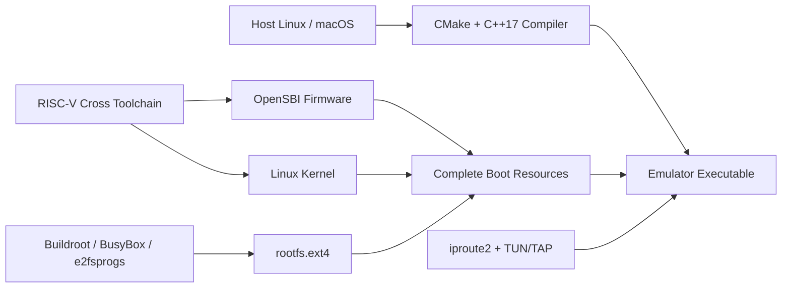

# Third-Party Dependencies, Downloads, and Installation Guide

## 1. Purpose

This document explains the third-party software involved in building and running `homemade-risc-v-64-vector-linux-emulator`: what problems they solve, whether they are mandatory, where to obtain them, and why they must not be directly committed to this repository.

The emulator project itself strictly insists on implementing the CPU, MMU, bus, and virtual peripherals from scratch, without using off-the-shelf emulators like QEMU or Spike to act as project functionality. Third-party tools are used solely to compile source code, generate boot resources, or provide the guest operating system. OpenSBI, Linux, and BusyBox are software executed by the emulator, not part of the emulator internal implementation.

All downloaded files, external source code, and generated images should be saved under `artifacts/`. This directory is excluded by `.gitignore`; large binaries, copies of third-party source code, or host network configurations must not be committed to Git.

## 2. Dependency Overview



| Category | Third-Party Project | Mandatory? | Provided / Generated Artifacts |
| --- | --- | --- | --- |
| Host Build | CMake, GCC or Clang | Yes | Compiles emulator and runs tests |
| Build Acceleration | Ninja | Optional | Executes CMake-generated build tasks faster |
| Cross Compilation | RISC-V GNU Toolchain | Yes (for boot resources) | `riscv64-linux-gnu-*` compilers, linkers, and binary tools |
| Machine Firmware | OpenSBI | Yes (for full boot) | M-mode firmware `opensbi.bin` |
| Operating System | Linux Kernel | Yes (for full boot) | RISC-V Linux kernel `vmlinux.bin` |
| Minimal Userspace | Buildroot, BusyBox | Yes (for full boot) | Shell, basic commands, startup scripts, and network tools |
| Filesystem | e2fsprogs | Yes (for ext4 image) | `mkfs.ext4`, `debugfs`, `e2fsck` |
| Device Tree | Device Tree Compiler | Yes (for FDT) | `dtc`, `fdtdump`, `fdtget` |
| Host Networking | iproute2, nftables | Yes (for VirtIO Net test) | TAP, address, routing, bridge, or NAT configurations |

## 3. Recommended Host Environment

The project supports two host profiles. macOS handles real builds, tests, and boots to guest Shell with `--net none`; Linux adds `/dev/net/tun` TAP network final acceptance on top of the same boot capabilities. macOS does not need to install or emulate iproute2, nftables, or Linux TAP.

Recommended specifications:

- 64-bit Ubuntu 24.04 LTS or equivalent Linux distribution.
- GCC or Clang supporting C++17.
- CMake 3.20 or higher.
- At least 16 GiB available disk space; reserve more space when building full cross-toolchains from source.
- At least 8 GiB RAM recommended for building boot resources; emulator execution memory depends on guest RAM configuration.
- `CAP_NET_ADMIN` or controlled `sudo` privileges when creating TAP, bridge, or NAT interfaces.

## 4. One-Time Installation on Ubuntu/Debian

The following packages cover emulator compilation, Linux/OpenSBI cross-compilation, kernel configuration, device trees, ext4 images, and TAP network management:

```bash
sudo apt update
sudo apt install --no-install-recommends \
  build-essential cmake ninja-build git curl wget ca-certificates \
  python3 file rsync bc bison flex pkg-config \
  libssl-dev libelf-dev libncurses-dev \
  gcc-riscv64-linux-gnu binutils-riscv64-linux-gnu \
  device-tree-compiler e2fsprogs cpio xz-utils bzip2 \
  iproute2 nftables
```

Distribution packages offer easy installation and security updates. If system CMake is below 3.20, use signed packages from the [official CMake download page](https://cmake.org/download/), rather than downloading executables from untrusted mirrors.

Verify key tools:

```bash
cmake --version
c++ --version
riscv64-linux-gnu-gcc --version
dtc --version
mkfs.ext4 -V
ip -Version
```

### 4.1 Base Installation on macOS/Homebrew

Local macOS builds install only currently required base tools, excluding Linux network components:

```bash
brew install cmake ninja
```

Verify:

```bash
brew --version
cmake --version
ninja --version
c++ --version
```

Device tree, ext4, and RISC-V target tools should be verified against `brew info <formula>` upon reaching corresponding build nodes; documentation must not assume unverified formulas provide RISC-V cross toolchains. OpenSBI, Linux, and rootfs remain in ignored `artifacts/`, and macOS consumes these real guest artifacts for non-networked boots.

## 5. Detailed Breakdown of Third-Party Resources

### 5.1 CMake

CMake reads `CMakeLists.txt` at the repository root, generates the local build system, and runs tests via CTest. It is not involved in running the emulator nor linked into the final executable.

- Minimum Version: 3.20.
- Official Download: [cmake.org/download](https://cmake.org/download/).
- License: BSD 3-Clause; specific text per downloaded package.
- Preferred Installation: Linux distribution package; use official Kitware packages only if version is insufficient.

### 5.2 GCC, Clang, and Ninja

GCC or Clang compiles the project C++17 source code into host executables. Select either compiler; host compilers must not be confused with RISC-V cross-compilers. Ninja is an optional build executor and does not alter emulator semantics.

- GCC Official Site: [gcc.gnu.org](https://gcc.gnu.org/).
- LLVM/Clang Official Site: [llvm.org](https://llvm.org/).
- Ninja Official Site: [ninja-build.org](https://ninja-build.org/).
- Recommended installation via distribution package manager for matching system C/C++ runtime libraries.

### 5.3 RISC-V GNU Toolchain

RISC-V GNU Toolchain is a collection of cross-compilers. The host machine is usually x86-64 or AArch64, while it generates RV64 machine code for OpenSBI, Linux, and guest applications. Common prefixes are `riscv64-linux-gnu-`, such as `riscv64-linux-gnu-gcc`, `objcopy`, and `readelf`.

- Official Source: [riscv-collab/riscv-gnu-toolchain](https://github.com/riscv-collab/riscv-gnu-toolchain).
- Preferred Installation: Ubuntu/Debian `gcc-riscv64-linux-gnu` and `binutils-riscv64-linux-gnu`.
- Source Build: Use only when distribution toolchains lack required RVV support or target ABI; upstream repository includes submodules and large source packages taking significant disk and build time.
- Project Target ABI: RV64 LP64D; final build flags must remain consistent across kernel, OpenSBI, and guest userspace.

If building from source is mandatory, clone into ignored directories rather than repository source paths:

```bash
git clone https://github.com/riscv-collab/riscv-gnu-toolchain \
  artifacts/downloads/riscv-gnu-toolchain
```

Full configuration parameters must be frozen after setting compatibility baselines, avoiding arbitrary changes to `--with-arch` or `--with-abi`.

### 5.4 OpenSBI

OpenSBI is an open-source Supervisor Binary Interface implementation running in M-mode. It handles machine-level initialization, provides SBI services (timer, IPI, system reset) to S-mode Linux, and forwards allowed exceptions/interrupts to Linux per delegation registers. It is the first real workload to verify CSRs, trap delegation, and privilege returns.

- Official Repository: [riscv-software-src/opensbi](https://github.com/riscv-software-src/opensbi).
- Official Releases: [OpenSBI Releases](https://github.com/riscv-software-src/opensbi/releases).
- Firmware Documentation: [OpenSBI firmware documentation](https://github.com/riscv-software-src/opensbi/blob/master/docs/firmware/fw.md).
- License: BSD 2-Clause; check third-party notices in release packages.

This project requires firmware matching our virtual machine memory layout; arbitrary precompiled binaries for other boards must not be used. Freeze an upstream stable tag, build `FW_JUMP` or `FW_DYNAMIC` images matching our boot protocol, and copy to:

```text
artifacts/firmware/opensbi.bin
```

### 5.5 Linux Kernel

Linux Kernel is the guest operating system kernel running in S-mode. It exercises page tables, atomic instructions, interrupts, UART, VirtIO-Blk, and VirtIO-Net, serving as the core acceptance object for full-system correctness.

- Official Homepage & Signed Downloads: [kernel.org](https://www.kernel.org/).
- Active & Longterm Releases: [Active kernel releases](https://www.kernel.org/releases.html).
- Official Source Archives: [kernel.org/pub/linux/kernel](https://www.kernel.org/pub/linux/kernel/).
- License: GPL-2.0-only; per `COPYING` in chosen kernel version.

Select stable or LTS releases; do not use `-rc` pre-releases as default acceptance baselines. Kernel requires enabling RISC-V 64-bit, SMP matching actual hart count, 8250/16550 serial, VirtIO MMIO, VirtIO Block, VirtIO Net, ext4, devtmpfs, and IPv4/DNS support. Generated raw kernel images are placed in:

```text
artifacts/kernel/vmlinux.bin
```

Download signatures or checksums to verify downloaded source archives. Source code may be stored in `artifacts/downloads/`, but must not be committed.

### 5.6 Buildroot and BusyBox

The Linux kernel does not include a Shell, `init`, filesystem directories, or user utilities. A minimal userspace is provided by BusyBox; Buildroot cross-compiles BusyBox, runtimes, and network tools while generating reproducible ext4 root filesystems.

Recommend Buildroot as the sole rootfs generation chain to avoid maintaining hand-crafted initramfs, hand-crafted ext4, and secondary distribution root filesystems simultaneously. BusyBox remains the core userspace component within Buildroot.

- Buildroot Official Site: [buildroot.org](https://buildroot.org/).
- Buildroot Downloads: [buildroot.org/downloads](https://buildroot.org/downloads/).
- Buildroot Manual: [Buildroot manual](https://buildroot.org/downloads/manual/manual.html).
- BusyBox Official Site: [busybox.net](https://busybox.net/).
- BusyBox Source Entry: [busybox.net/source.html](https://busybox.net/source.html).
- BusyBox License: GPL-2.0; Buildroot and output contain multiple licenses; save generated license manifests.

rootfs must contain working `init`, Shell, `/dev`, `/proc`, `/sys` mount logic, network tools, and DHCP client/`ping` required by PRD commands. If minimal images use BusyBox `udhcpc`, provide compatible `dhclient` commands or adjust acceptance image configs without faking commands at test time.

Final Image Location:

```text
artifacts/disk/rootfs.ext4
```

### 5.7 Device Tree Compiler

Device Tree Compiler compiles text DTS into binary DTB read by Linux/OpenSBI, and decompiles/inspects outputs. FDT must describe CPU ISA, memory, CLINT, PLIC, UART, and two VirtIO MMIO regions; wrong interrupt numbers or addresses will cause Linux to hang silently.

- Official Source: [kernel.org Device Tree Compiler](https://git.kernel.org/pub/scm/utils/dtc/dtc.git/).
- Official Archives: [kernel.org/pub/software/utils/dtc](https://www.kernel.org/pub/software/utils/dtc/).
- Ubuntu/Debian Package: `device-tree-compiler`.

### 5.8 e2fsprogs

e2fsprogs provides `mkfs.ext4`, `e2fsck`, `resize2fs`, and `debugfs`. Used only on host to create, check, or maintain `rootfs.ext4`; the emulator itself sees VirtIO block requests and does not parse ext4 filesystem structures directly.

- Official Source: [git.kernel.org e2fsprogs](https://git.kernel.org/pub/scm/fs/ext2/e2fsprogs.git/).
- Official Release Archives: [kernel.org e2fsprogs](https://www.kernel.org/pub/linux/kernel/people/tytso/e2fsprogs/).
- Ubuntu/Debian Package: `e2fsprogs`.

Run `e2fsck -fn` read-only checks after image creation. Do not perform unconfirmed repairs on sole images; retain reproducible build configs and logs.

### 5.9 iproute2, nftables, and Linux TUN/TAP

VirtIO-Net backend opens `/dev/net/tun` and binds to TAP. TAP passes full Ethernet frames, suitable for Linux bridges or NAT; TUN passes IP packets only and cannot replace the TAP data link required by this project.

- Linux TUN/TAP Documentation: [Kernel TUN/TAP documentation](https://docs.kernel.org/networking/tuntap.html).
- iproute2 Official Archives: [kernel.org iproute2](https://www.kernel.org/pub/linux/utils/net/iproute2/).
- nftables Official Project: [netfilter.org/nftables](https://www.netfilter.org/projects/nftables/).
- Ubuntu/Debian Packages: `iproute2` and `nftables`.

Creating interfaces, bridges, routes, or NAT alters host network state; perform explicitly according to physical interfaces, firewalls, and subnets. This repository will not automatically alter host networking during build phases.

## 6. Download and Artifact Directories

```text
artifacts/
├── downloads/       # Third-party source archives or temporary clones
├── firmware/
│   └── opensbi.bin
├── kernel/
│   └── vmlinux.bin
├── rootfs/          # Rootfs staging directory or Buildroot output logs
├── disk/
│   └── rootfs.ext4
└── logs/            # Boot and acceptance logs
```

File sources and build processes must record version tags, download URLs, SHA-256 hashes, build configs, compiler versions, and licenses. Do not keep untraced binary files alone.

## 7. Integrity and License Rules

1. Download only from official sites or official distribution repositories listed here.
2. Prefer tagged stable releases; do not use moving `master`/`main` branches as reproducible baselines.
3. Verify SHA-256 hashes for downloaded archives; verify signatures when provided upstream.
4. Third-party licenses remain unchanged regardless of our MIT License.
5. Do not commit OpenSBI, Linux, BusyBox, Buildroot, toolchains, or rootfs binaries to this repository.
6. Do not store tokens, `sudo` passwords, host interface names, private keys, or firewall snapshots in the repository.
7. Perform standalone license audits before releasing test images; "for learning only" is not an excuse to ignore open-source license obligations.

## 8. Next Steps

After completing dependency setup, follow `docs/quickstart.md` to build the emulator, place boot resources, and execute the Linux boot flow. Actual progress remains tracked in `specs/tasks.md`.
