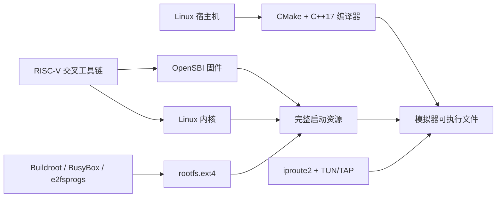

# 第三方依赖、下载与安装指南

## 1. 文档目的

本文解释构建和运行 `homemade-risc-v-64-vector-linux-emulator` 所涉及的第三方软件：它们分别解决什么问题、是否必须、应从哪里获取，以及为什么不能直接提交到本仓库。

项目本体坚持从零实现 CPU、MMU、总线和虚拟设备，不使用 QEMU、Spike 等现成模拟器充当项目功能。第三方工具只用于编译源码、制作启动资源或提供来宾系统；OpenSBI、Linux 和 BusyBox 是模拟器所运行的软件，不是模拟器内部实现的一部分。

所有下载文件、外部源码和生成镜像都应保存在 `artifacts/` 下。该目录已被 `.gitignore` 排除，不得将大型二进制、第三方源码副本或本机网络配置提交到 Git。

## 2. 依赖关系总览



| 分类 | 第三方项目 | 是否必须 | 产生或提供的内容 |
| --- | --- | --- | --- |
| 本机构建 | CMake、GCC 或 Clang | 必须 | 编译模拟器及运行测试 |
| 构建加速 | Ninja | 可选 | 更快地执行 CMake 生成的构建任务 |
| 交叉编译 | RISC-V GNU Toolchain | 制作启动资源时必须 | `riscv64-linux-gnu-*` 编译器、链接器和二进制工具 |
| 机器固件 | OpenSBI | 完整启动必须 | M-mode 固件 `opensbi.bin` |
| 操作系统 | Linux Kernel | 完整启动必须 | RISC-V Linux 内核 `vmlinux.bin` |
| 最小用户空间 | Buildroot、BusyBox | 完整启动必须 | Shell、基础命令、启动脚本和网络工具 |
| 文件系统 | e2fsprogs | 制作 ext4 镜像时必须 | `mkfs.ext4`、`debugfs`、`e2fsck` |
| 设备树 | Device Tree Compiler | 构建或检查 FDT 时必须 | `dtc`、`fdtdump`、`fdtget` |
| 宿主网络 | iproute2、nftables | VirtIO 网络验收必须 | TAP、地址、路由、网桥或 NAT 配置 |

## 3. 推荐宿主环境

最终运行环境是 64 位 Linux。原因不是偏好，而是网络后端按 PRD 使用 Linux 的 `/dev/net/tun`、`TUNSETIFF` 和 TAP 以太网接口。macOS 可以编译和运行不涉及 TAP 的单元测试，但不能原样完成该 Linux 专用网络链路；在 macOS 开发时，应使用 Linux 虚拟机或独立 Linux 主机完成最终启动与联网验收。

推荐条件：

- 64 位 Ubuntu 24.04 LTS 或同等级 Linux 发行版。
- 支持 C++17 的 GCC 或 Clang。
- CMake 3.20 或更高版本。
- 至少 16 GiB 可用磁盘空间；从源码构建完整交叉工具链时建议预留更多空间。
- 构建启动资源时建议至少 8 GiB RAM；模拟器运行内存还取决于来宾 RAM 配置。
- 创建 TAP、网桥或 NAT 时具备 `CAP_NET_ADMIN` 或受控的 `sudo` 权限。

## 4. Ubuntu/Debian 一次性安装

下列软件包覆盖模拟器构建、Linux/OpenSBI 交叉编译、内核配置、设备树、ext4 镜像和 TAP 网络管理：

```bash
sudo apt update
sudo apt install --no-install-recommends \
  build-essential cmake ninja-build git curl wget ca-certificates \
  python3 file rsync bc bison flex pkg-config \
  libssl-dev libelf-dev libncurses-dev \
  gcc-riscv64-linux-gnu binutils-riscv64-linux-gnu \
  device-tree-compiler e2fsprogs cpio xz-utils bzip2 \
  iproute2 nftables
```

发行版包的优点是安装简单并能获得安全更新。若发行版中的 CMake 低于 3.20，应改用 [CMake 官方下载页](https://cmake.org/download/) 提供的已签名发行包，不要从不明镜像站下载可执行文件。

验证关键工具：

```bash
cmake --version
c++ --version
riscv64-linux-gnu-gcc --version
dtc --version
mkfs.ext4 -V
ip -Version
```

## 5. 各项第三方资源详解

### 5.1 CMake

CMake 读取仓库根目录的 `CMakeLists.txt`，生成本地构建系统，并通过 CTest 统一运行测试。它不参与模拟器运行，也不会被链接进最终可执行文件。

- 最低版本：3.20。
- 官方下载：[cmake.org/download](https://cmake.org/download/)。
- 许可证：BSD 3-Clause；具体文本以下载版本附带文件为准。
- 安装首选：Linux 发行版包；只有版本不足时才使用 Kitware 官方包。

### 5.2 GCC、Clang 与 Ninja

GCC 或 Clang 把项目的 C++17 源码编译为宿主机可执行文件。两者任选其一即可；不能把宿主编译器与 RISC-V 交叉编译器混为一谈。Ninja 只是可选的构建执行器，不影响模拟器语义。

- GCC 官方入口：[gcc.gnu.org](https://gcc.gnu.org/)。
- LLVM/Clang 官方入口：[llvm.org](https://llvm.org/)。
- Ninja 官方入口：[ninja-build.org](https://ninja-build.org/)。
- 推荐通过发行版包管理器安装，以便获得与系统 C/C++ 运行库匹配的版本。

### 5.3 RISC-V GNU Toolchain

RISC-V GNU Toolchain 是交叉编译器集合。宿主机通常是 x86-64 或 AArch64，而它生成 RV64 机器码，用来构建 OpenSBI、Linux 和来宾程序。常用前缀为 `riscv64-linux-gnu-`，例如 `riscv64-linux-gnu-gcc`、`objcopy` 和 `readelf`。

- 官方源码：[riscv-collab/riscv-gnu-toolchain](https://github.com/riscv-collab/riscv-gnu-toolchain)。
- 首选安装：Ubuntu/Debian 的 `gcc-riscv64-linux-gnu` 与 `binutils-riscv64-linux-gnu`。
- 源码构建：仅当发行版工具链缺少所需 RVV 支持或目标 ABI 时使用；上游仓库包含子模块和大量源包，下载及构建会占用较多磁盘和时间。
- 本项目目标 ABI：RV64 的 LP64D；最终编译参数必须与内核、OpenSBI及来宾用户空间保持一致。

若必须从源码构建，应克隆到被忽略的目录，而不是仓库源码目录：

```bash
git clone https://github.com/riscv-collab/riscv-gnu-toolchain \
  artifacts/downloads/riscv-gnu-toolchain
```

完整配置参数应在兼容性基线确定后固定，不能每次随意更换 `--with-arch` 或 `--with-abi`。

### 5.4 OpenSBI

OpenSBI 是运行在 M-mode 的开源 Supervisor Binary Interface 实现。它完成机器级初始化，为 S-mode Linux 提供定时器、IPI、系统复位等 SBI 服务，并依据委托寄存器把允许的异常和中断交给 Linux。它是验证 CSR、Trap 委托和特权返回逻辑的第一道真实工作负载。

- 官方仓库：[riscv-software-src/opensbi](https://github.com/riscv-software-src/opensbi)。
- 官方发行版：[OpenSBI Releases](https://github.com/riscv-software-src/opensbi/releases)。
- 固件类型说明：[OpenSBI firmware documentation](https://github.com/riscv-software-src/opensbi/blob/master/docs/firmware/fw.md)。
- 许可证：BSD 2-Clause；同时检查发行包中的第三方声明。

本项目需要与虚拟机内存布局匹配的固件，不能随便拿其他开发板的预编译二进制。推荐固定一个上游稳定 tag，从官方源码构建适配本项目启动协议的 `FW_JUMP` 或 `FW_DYNAMIC` 镜像，然后复制为：

```text
artifacts/firmware/opensbi.bin
```

### 5.5 Linux Kernel

Linux Kernel 是运行在 S-mode 的来宾操作系统内核。它真实使用页表、原子指令、中断、UART、VirtIO-Blk 和 VirtIO-Net，是全系统功能是否正确的核心验收对象。

- 官方主页与签名下载：[kernel.org](https://www.kernel.org/)。
- 活跃及长期维护版本：[Active kernel releases](https://www.kernel.org/releases.html)。
- 官方源码归档：[kernel.org/pub/linux/kernel](https://www.kernel.org/pub/linux/kernel/)。
- 许可证：GPL-2.0-only；以所选内核版本的 `COPYING` 为准。

应选择稳定或长期维护版本，不使用 `-rc` 预发布版本作为默认验收基线。内核至少需要启用 RISC-V 64 位、SMP 配置与实际 Hart 数一致、串口 8250/16550、VirtIO MMIO、VirtIO Block、VirtIO Net、ext4、devtmpfs 和必要的 IPv4/DNS 支持。生成的原始内核镜像放在：

```text
artifacts/kernel/vmlinux.bin
```

下载内核源码后应同时下载签名或校验文件进行验证。源码可以暂存在 `artifacts/downloads/`，但不得提交。

### 5.6 Buildroot 与 BusyBox

Linux 内核本身不包含 Shell、`init`、文件系统目录或常用命令。最小用户空间通常由 BusyBox 提供；Buildroot 则负责交叉编译 BusyBox、运行库和额外网络工具，并可生成可重复的 ext4 根文件系统。

推荐以 Buildroot 作为唯一的 rootfs 生成链路，避免同时维护手写 initramfs、手写 ext4 和另一套发行版根文件系统。BusyBox 仍是 Buildroot 中的核心用户空间组件。

- Buildroot 官方站点：[buildroot.org](https://buildroot.org/)。
- Buildroot 下载：[buildroot.org/downloads](https://buildroot.org/downloads/)。
- Buildroot 用户手册：[Buildroot manual](https://buildroot.org/downloads/manual/manual.html)。
- BusyBox 官方站点：[busybox.net](https://busybox.net/)。
- BusyBox 官方源码入口：[busybox.net/source.html](https://busybox.net/source.html)。
- BusyBox 许可证：GPL-2.0；Buildroot 及其输出包含多个许可证，必须保存生成的许可证清单。

rootfs 必须包含可用的 `init`、Shell、`/dev`、`/proc`、`/sys` 挂载逻辑、网络配置工具，以及 PRD 验收命令所需的 DHCP 客户端和 `ping`。若最小镜像使用 BusyBox `udhcpc`，还应额外提供兼容的 `dhclient` 命令或调整验收镜像配置，不能在验收时临时伪造命令。

最终镜像位置：

```text
artifacts/disk/rootfs.ext4
```

### 5.7 Device Tree Compiler

Device Tree Compiler 将文本 DTS 编译为 Linux/OpenSBI 可读取的二进制 DTB，也能反编译和检查生成结果。FDT 必须精确描述 CPU ISA、内存、CLINT、PLIC、UART 和两个 VirtIO MMIO 区域；错误的中断号或地址会造成 Linux 静默卡住。

- 官方源码：[kernel.org Device Tree Compiler](https://git.kernel.org/pub/scm/utils/dtc/dtc.git/)。
- 官方归档：[kernel.org/pub/software/utils/dtc](https://www.kernel.org/pub/software/utils/dtc/)。
- Ubuntu/Debian 包：`device-tree-compiler`。

### 5.8 e2fsprogs

e2fsprogs 提供 `mkfs.ext4`、`e2fsck`、`resize2fs` 和 `debugfs`。它只用于在宿主机创建、检查或维护 `rootfs.ext4`；模拟器本身只看见 VirtIO 块请求，不解析 ext4 文件系统结构。

- 官方源码：[git.kernel.org e2fsprogs](https://git.kernel.org/pub/scm/fs/ext2/e2fsprogs.git/)。
- 官方发布归档：[kernel.org e2fsprogs](https://www.kernel.org/pub/linux/kernel/people/tytso/e2fsprogs/)。
- Ubuntu/Debian 包：`e2fsprogs`。

制作镜像后必须运行 `e2fsck -fn` 做只读一致性检查。不要对唯一镜像直接执行未经确认的修复操作；应保留可重新生成镜像的配置和构建记录。

### 5.9 iproute2、nftables 与 Linux TUN/TAP

VirtIO-Net 后端打开 `/dev/net/tun` 并绑定 TAP。TAP 传递完整以太网帧，适合接入 Linux bridge 或 NAT；TUN 只传递 IP 包，不能替代本项目要求的 TAP 数据链路。

- Linux TUN/TAP 官方说明：[Kernel TUN/TAP documentation](https://docs.kernel.org/networking/tuntap.html)。
- iproute2 官方归档：[kernel.org iproute2](https://www.kernel.org/pub/linux/utils/net/iproute2/)。
- nftables 官方项目：[netfilter.org/nftables](https://www.netfilter.org/projects/nftables/)。
- Ubuntu/Debian 包：`iproute2` 与 `nftables`。

创建接口、网桥、路由或 NAT 会改变宿主机网络状态，必须由用户明确执行，并根据实际物理接口、防火墙和地址规划配置。本仓库不会在构建阶段自动修改宿主网络。

## 6. 下载目录与产物目录

```text
artifacts/
├── downloads/       # 第三方源码压缩包或临时 clone
├── firmware/
│   └── opensbi.bin
├── kernel/
│   └── vmlinux.bin
├── rootfs/          # rootfs 暂存目录或 Buildroot 输出记录
├── disk/
│   └── rootfs.ext4
└── logs/            # 启动及验收日志
```

文件来源和生成过程应记录版本 tag、下载 URL、SHA-256、构建配置、编译器版本及许可证。不能只保留一个来历不明的二进制文件。

## 7. 完整性与许可证规则

1. 只从本文列出的官方站点或发行版官方仓库下载。
2. 优先选择带 tag 的稳定版本，拒绝把移动的 `master`/`main` 当作可复现基线。
3. 对下载归档校验 SHA-256；上游提供签名时同时验证签名。
4. 第三方许可证不因本项目采用 MIT 而改变。
5. 不把 OpenSBI、Linux、BusyBox、Buildroot、工具链或 rootfs 二进制提交到本仓库。
6. 不在仓库中保存 token、`sudo` 密码、主机接口名称、私钥或本机防火墙快照。
7. 发布测试镜像前单独完成许可证审计；“仅供学习”不是忽略开源许可证义务的理由。

## 8. 下一步

依赖安装完成后，按照 `docs/quickstart.md` 构建模拟器、放置启动资源并执行完整 Linux 启动流程。实际实现进度仍以 `specs/tasks.md` 为准。
