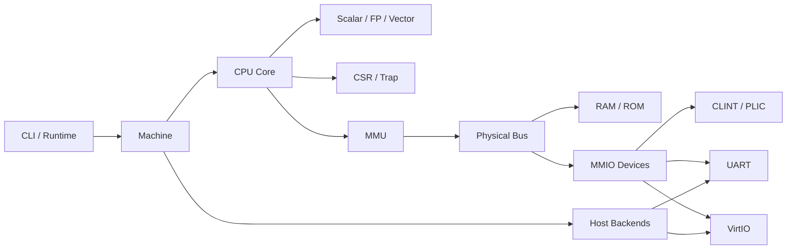

# 总体架构规格

## 1. 架构原则

- **ARCH-REQ-001**：系统必须采用解释执行的单一 CPU 主循环，不得存在用于演示或测试的第二套简化执行器。
- **ARCH-REQ-002**：虚拟地址访问、物理总线访问和宿主资源访问必须分层，禁止跨层绕过。
- **ARCH-REQ-003**：CPU、MMU、总线、设备和宿主后端必须通过职责清晰的接口协作。
- **ARCH-REQ-004**：所有可观察状态变化必须由确定的指令、设备事件或宿主输入驱动。
- **ARCH-REQ-005**：首版机器模型按单 Hart 定义；设计不得阻止未来扩展，但不得为了未来能力增加未经验证的多套逻辑。

## 2. 逻辑组件

`Machine` 只负责组合和生命周期。CPU 不得知道 TAP 或磁盘文件；VirtIO 设备不得直接修改 CPU 私有 CSR，而应通过中断控制器接口表达中断线状态。

## 3. 内存访问分层

### 3.1 来宾虚拟访问

CPU 发起取指、加载、存储或原子访问时，提交虚拟地址、访问类型、宽度、当前特权级和必要状态。MMU 决定直通或 Sv39 翻译，并返回物理地址或精确异常。

### 3.2 页表物理访问

页表漫游读取/更新 PTE 时使用物理总线，不得再次进入虚拟地址翻译。PTE 更新必须保证来宾可观察的原子性，并通过统一 RAM/总线规则检查物理访问错误。

### 3.3 设备 DMA 访问

VirtIO 描述符中的地址按 transport 规定解释为来宾物理地址。设备必须使用受控 DMA 物理内存接口，执行溢出、范围、可写性和描述符方向检查。

## 4. 单步执行事务

一次 CPU 步进按以下逻辑顺序进行：

1. 在指令边界检查可接收中断。
2. 使用取指访问类型读取第一个 16 位半字。
3. 根据低两位判断指令长度；32 位指令再读取后续半字。
4. 译码并执行，所有异常以结构化 Trap 结果返回。
5. 指令成功时提交架构状态；同步异常时不得提交不允许的部分副作用。
6. 推进设备时间并处理可用的宿主非阻塞事件。
7. 汇总 CLINT/PLIC 信号到 CSR pending 位，进入下一指令边界。

精确的中断采样点必须保持一致，不能因设备类型或调试模式改变。

## 5. 时间模型

- **ARCH-REQ-006**：CLINT 时间必须采用规格定义的单调来源，不能因宿主墙上时间回拨而倒退。
- **ARCH-REQ-007**：执行确定性测试时可使用明确配置的虚拟时钟，但系统验收必须验证真实事件循环。
- **ARCH-REQ-008**：CPU 指令计数和 `mtime` 频率必须分离，FDT 中的 `timebase-frequency` 必须与实现一致。

PRD 中“每条指令 tick”描述确定了同步点，不等同于规定 `mtime` 每条指令固定加一。具体换算必须在实现前冻结，保证 Linux 时间行为合理。

## 6. 错误边界

- 来宾非法指令、页错误和访问错误必须作为来宾 Trap，不应直接终止宿主进程。
- 无法打开 BIOS、磁盘、TAP 或终端配置失败属于宿主错误，应产生清晰诊断并安全退出。
- 内部不变量破坏属于模拟器缺陷，应报告状态上下文，恢复终端后非零退出。
- 不得将“返回零”作为所有未实现 MMIO 或 CSR 的通用行为。

## 7. 并发模型

首版采用单主循环维护架构状态，避免 CPU 与设备线程同时修改来宾内存和中断状态。若 TAP 输入使用辅助线程，该线程只能将不可变数据包送入有界线程安全队列；队列消费、DMA 和中断更新仍在主循环串行提交。

## 8. 验收条件

- 组件依赖符合 `project-tree.md`，无 CPU 到具体宿主后端的依赖。
- 所有取指和数据访问经过同一 MMU/总线路径。
- 所有 VirtIO DMA 经过唯一受控物理访问接口。
- 同一输入和虚拟时间配置下，纯 CPU/内存测试可重复。
- 来宾 Trap 不会破坏宿主资源清理流程。
