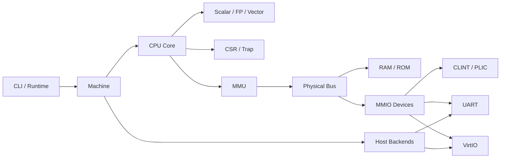

# Overall Architecture Specification

## 1. Architectural Principles

- **ARCH-REQ-001**: The system must utilize an interpreted single CPU main loop, and must not maintain a secondary simplified executor for demonstration or testing.
- **ARCH-REQ-002**: Virtual address access, physical bus access, and host resource access must be layered, prohibiting cross-layer bypasses.
- **ARCH-REQ-003**: CPU, MMU, bus, devices, and host backends must collaborate through clearly specified interfaces.
- **ARCH-REQ-004**: All observable state changes must be driven by deterministic instructions, device events, or host input.
- **ARCH-REQ-005**: Initial machine model is defined as single-hart; design must not prevent future extension, but must not introduce unverified multiple logic sets for future capabilities.

## 2. Logical Components

`Machine` handles only assembly and lifecycle. CPU must not know about TAP or disk files; VirtIO devices must not directly mutate CPU-private CSRs, but should express interrupt line state through interrupt controller interfaces.

## 3. Memory Access Layering

### 3.1 Guest Virtual Access

When CPU initiates instruction fetch, load, store, or atomic access, it submits virtual address, access type, width, current privilege mode, and necessary state. MMU determines passthrough or Sv39 translation, returning physical address or precise exception.

### 3.2 Page Table Physical Access

Page table walk reads/updates of PTEs use the physical bus and must not re-enter virtual address translation. PTE updates must guarantee guest-observable atomicity and check physical access errors via uniform RAM/bus rules.

### 3.3 Device DMA Access

Addresses in VirtIO descriptors are interpreted as guest physical addresses per transport rules. Devices must use controlled DMA physical memory interfaces, executing overflow, bounds, writability, and descriptor direction checks.

## 4. Single-Step Execution Transaction

A single CPU step follows this logical sequence:

1. Check receivable interrupts at instruction boundaries.
2. Read the first 16-bit halfword using instruction fetch access type.
3. Determine instruction length by lower two bits; 32-bit instructions fetch subsequent halfwords.
4. Decode and execute, with all exceptions returned as structured Trap results.
5. Commit architectural state upon instruction success; synchronous exceptions must not commit disallowed partial side effects.
6. Advance device time and process available host non-blocking events.
7. Aggregate CLINT/PLIC signals into CSR pending bits, entering next instruction boundary.

Precise interrupt sampling points must remain consistent and must not alter due to device type or debug mode.

## 5. Time Model

- **ARCH-REQ-006**: CLINT time must use a spec-defined monotonic source, and must not regress due to host wall-clock fallbacks.
- **ARCH-REQ-007**: Deterministic test execution may use explicitly configured virtual clocks, but system acceptance must verify real event loops.
- **ARCH-REQ-008**: CPU instruction count and `mtime` frequency must be separated, and `timebase-frequency` in FDT must align with implementation.

The PRD "tick per instruction" description establishes synchronization points, not a requirement that `mtime` strictly increments by one per instruction. Specific conversions must be frozen before implementation to ensure reasonable Linux time behavior.

## 6. Error Boundaries

- Guest illegal instructions, page faults, and access faults must act as guest Traps, and should not directly terminate host process.
- Inability to open BIOS, disk, TAP, or terminal configuration failures are host errors, producing clear diagnostics and exiting safely.
- Internal invariant breakage is an emulator defect, reporting state context and exiting non-zero after terminal restoration.
- Returning zero must not serve as a universal fallback for all unimplemented MMIO or CSRs.

## 7. Concurrency Model

The initial release uses a single main loop maintaining architectural state, avoiding CPU and device threads mutating guest memory and interrupt state simultaneously. If TAP input utilizes a helper thread, that thread may only push immutable packets into a bounded thread-safe queue; queue consumption, DMA, and interrupt updates remain serially committed in the main loop.

## 8. Acceptance Criteria

- Component dependencies conform to `project-tree.md`, with no CPU dependencies on specific host backends.
- All instruction fetches and data accesses pass through the same MMU/bus path.
- All VirtIO DMA passes through the sole controlled physical access interface.
- Pure CPU/memory tests are reproducible under identical input and virtual time configurations.
- Guest Traps do not destroy host resource cleanup procedures.
