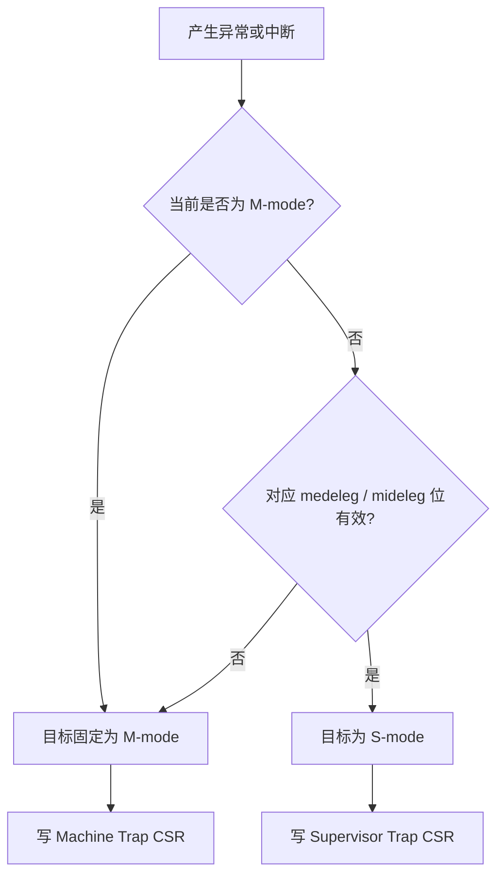

# CPU、特权级与 CSR 规格

## 1. 架构状态

- **CPU-REQ-001**：提供 32 个 64 位整数寄存器 `x0..x31`；所有读取 `x0` 返回 0，任何写入均被丢弃。
- **CPU-REQ-002**：提供 32 个 64 位浮点寄存器 `f0..f31`，支持 F/D 状态和 NaN boxing。
- **CPU-REQ-003**：提供 32 个 VLEN=256 位向量寄存器，详细语义见 RVV 规格。
- **CPU-REQ-004**：提供 64 位 `pc`、当前特权级、CSR 存储、LR/SC 保留状态和等待状态。
- **CPU-REQ-005**：支持 Machine、Supervisor、User 三种特权级，不实现不存在的 Hypervisor 模式。

寄存器保存无类型位模式。有符号或无符号解释由具体指令决定，不能在寄存器层保存“有符号属性”。

## 2. 必需 CSR 集合

除 PRD 明列项目外，为启动标准 OpenSBI/Linux，必须同时覆盖相关规范 CSR：

- Machine：`misa`、`mvendorid`、`marchid`、`mimpid`、`mhartid`、`mstatus`、`medeleg`、`mideleg`、`mie`、`mtvec`、`mscratch`、`mepc`、`mcause`、`mtval`、`mip`、`mcounteren`。
- Supervisor：`sstatus`、`sie`、`stvec`、`scounteren`、`sscratch`、`sepc`、`scause`、`stval`、`sip`、`satp`。
- 浮点：`fflags`、`frm`、`fcsr`。
- 向量：`vstart`、`vxsat`、`vxrm`、`vcsr`、`vl`、`vtype`、`vlenb`。
- 计数器：目标 Linux 实际读取的 `cycle/time/instret` 及其高层访问控制。

每个 CSR 必须定义地址、最低访问特权、读写属性、WARL/WPRI 规则、复位值和别名关系。

## 3. CSR 访问规则

- **CPU-REQ-006**：CSR 指令必须原子完成读取与条件写入。
- **CPU-REQ-007**：访问不存在、权限不足或写只读 CSR 必须触发非法指令异常。
- **CPU-REQ-008**：`CSRRS/CSRRC` 源值为零时不得产生写副作用；立即数版本遵循同样规则。
- **CPU-REQ-009**：WARL 字段写入非法值后必须读回合法值，不能保留任意非法组合。
- **CPU-REQ-010**：`sstatus/sie/sip` 是机器级 CSR 的受限视图，不得维护为独立且可能分叉的副本。

## 4. `mstatus` 与 `sstatus`

至少实现中断栈字段 `MIE/MPIE/MPP`、`SIE/SPIE/SPP`，内存权限字段 `MPRV/SUM/MXR`，以及扩展状态字段 `FS/VS/XS/SD` 中目标软件使用的语义。

- `MPRV` 只影响显式加载/存储，不影响取指。
- `SUM` 控制 S 模式对 U 页的数据访问，不允许 S 模式从 U 页取指。
- `MXR` 允许加载从仅执行页读取。
- 浮点或向量状态变化必须按规范更新 `FS/VS`，从 Off 状态执行相应指令触发非法指令。

## 5. 中断 CSR

- `mie/mip` 保存机器级使能和挂起位。
- `sie/sip` 仅暴露被委托给 S 模式的允许位。
- 设备更新实际中断源状态，由集中逻辑投影到 pending 位；软件可写位必须严格按规范限制。
- 中断可接收性同时取决于 pending、enable、全局中断位、委托目标和当前特权级。

### 5.1 委托掩码与单一状态来源

- **CPU-REQ-011**：`medeleg/mideleg` 必须为每个真正可委托的 cause 定义可写掩码；规范不允许委托的位必须保持只读零。
- **CPU-REQ-012**：委托改变 Trap 的目标特权级，不复制 pending、enable 或 Trap 状态，也不允许生成第二套 S-mode 中断状态。
- **CPU-REQ-013**：`sie` 可见/可写位由 `mie` 与 `mideleg` 共同约束，`sip` 可见/可写位由 `mip`、`mideleg` 及各 pending 位的软件可写属性共同约束。
- **CPU-REQ-014**：在 M-mode 执行期间发生的 Trap 不得向 S-mode 委托；来自 S/U-mode 的 Trap 才按对应委托位选择目标。
- **CPU-REQ-015**：Trap 目标确定后，只能写目标层的 `epc/cause/tval/status`，另一层同类 CSR 必须保持不变。

委托选择必须使用统一流程：先确定 cause 和中断/异常类别，再检查发起特权级与委托位，最后按目标特权级计算全局使能、优先级和向量入口。禁止在 CLINT、PLIC、`ECALL` 或页错误处理器中分别复制委托判断。

OpenSBI 集成是本项的强制验证，而不是替代单元测试。必须记录 OpenSBI 实际写入的委托掩码、Linux 接收的监督级定时器/外部中断，以及 Trap 前后两层 CSR 的值。仅出现 OpenSBI Banner 不足以证明委托正确。

## 6. Trap 向量与返回状态

- `mtvec/stvec` 必须支持 Direct 模式，并按适用规范支持 Vectored 中断入口。
- 同步异常总是跳到 BASE；Vectored 模式仅对中断使用 `BASE + 4 × cause`。
- Trap 入口保存异常指令 PC 到 `mepc/sepc`，写入 `cause/tval`，更新前一特权级与中断栈字段。
- `MRET/SRET` 必须恢复特权级和中断使能，并按规范重置保存字段。
- `mepc/sepc` 的可写对齐位必须与 C 扩展启用状态一致。

## 7. `satp` 与地址空间

`satp` 必须提供 Bare 与 Sv39。写入不支持的 MODE 时按所选特权规范 WARL 行为处理。写 `satp` 本身不隐式刷新 TLB；软件通过 `SFENCE.VMA` 建立同步。

## 8. 复位状态

- 初始进入 M 模式，中断关闭。
- `pc` 指向规定的复位/固件入口。
- x0 为 0，其余寄存器和 CSR 采用明确、可测试的复位值。
- `mhartid` 首版为 0。
- `misa` 必须准确反映真正实现且启用的扩展，禁止宣称尚未完成的能力。

## 9. 验收条件

- 覆盖每个 CSR 的合法读写、权限拒绝、只读写入和 WARL 测试。
- 验证 S 级别名不会与 M 级状态分叉。
- 验证 M/S/U 间同步异常、委托中断和 `xRET` 往返。
- 验证 `MPRV/SUM/MXR/FS/VS` 对访问和指令合法性的影响。
- 逐位验证 `medeleg/mideleg` 的可写、只读零和读回行为。
- 验证相同 cause 在 M/S/U 三种来源下只进入规范允许的目标层。
- 使用真实 OpenSBI/Linux 验证监督级时钟与外部中断委托，且不存在初始化卡死。
