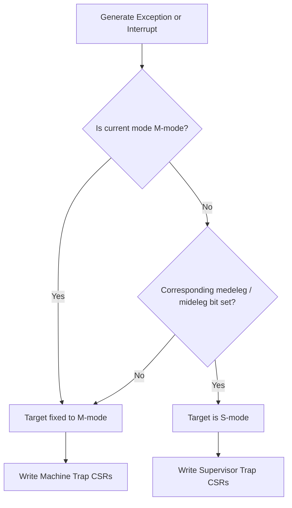

# CPU, Privilege Modes & CSR Specification

## 1. Architectural State

- **CPU-REQ-001**: Provide 32 64-bit integer registers `x0..x31`; reads from `x0` always return 0, and all writes are discarded.
- **CPU-REQ-002**: Provide 32 64-bit floating-point registers `f0..f31`, supporting F/D state and NaN boxing.
- **CPU-REQ-003**: Provide 32 VLEN=256 bit vector registers, detailed semantics in RVV spec.
- **CPU-REQ-004**: Provide 64-bit `pc`, current privilege level, CSR storage, LR/SC reservation state, and wait state.
- **CPU-REQ-005**: Support Machine, Supervisor, User privilege modes; do not implement absent Hypervisor mode.

Registers store untyped bit patterns. Signed or unsigned interpretation is determined by specific instructions, and signedness must not be stored at the register layer.

## 2. Mandatory CSR Set

In addition to items explicitly listed in PRD, the following spec CSRs must be covered to boot standard OpenSBI/Linux:

- Machine: `misa`, `mvendorid`, `marchid`, `mimpid`, `mhartid`, `mstatus`, `medeleg`, `mideleg`, `mie`, `mtvec`, `mscratch`, `mepc`, `mcause`, `mtval`, `mip`, `mcounteren`.
- Supervisor: `sstatus`, `sie`, `stvec`, `scounteren`, `sscratch`, `sepc`, `scause`, `stval`, `sip`, `satp`.
- Floating-Point: `fflags`, `frm`, `fcsr`.
- Vector: `vstart`, `vxsat`, `vxrm`, `vcsr`, `vl`, `vtype`, `vlenb`.
- Counters: `cycle/time/instret` and high-level access controls actually read by target Linux.

Every CSR must define its address, minimum access privilege, read-write attributes, WARL/WPRI rules, reset value, and aliasing relationships.

## 3. CSR Access Rules

- **CPU-REQ-006**: CSR instructions must atomically complete read and conditional write operations.
- **CPU-REQ-007**: Accessing non-existent, under-privileged, or writing to read-only CSRs must trigger illegal instruction exceptions.
- **CPU-REQ-008**: `CSRRS/CSRRC` with zero source value must not trigger write side effects; immediate versions follow identical rules.
- **CPU-REQ-009**: Writing illegal values to WARL fields must read back legal values, retaining no arbitrary illegal combinations.
- **CPU-REQ-010**: `sstatus/sie/sip` are restricted views of Machine-level CSRs and must not be maintained as independent, forkable copies.

## 4. `mstatus` and `sstatus`

Implement at least interrupt stack fields `MIE/MPIE/MPP`, `SIE/SPIE/SPP`, memory privilege fields `MPRV/SUM/MXR`, and extension status fields `FS/VS/XS/SD` semantics used by target software.

- `MPRV` affects only explicit loads/stores, not instruction fetches.
- `SUM` controls S-mode data access to U pages, disallowing S-mode instruction fetch from U pages.
- `MXR` permits loads from execute-only pages.
- Floating-point or vector state changes must update `FS/VS` per spec; executing matching instructions from Off state triggers illegal instruction.

### 4.1 Floating-Point CSRs and FS State

- **CPU-REQ-016**: `fflags=0x001`, `frm=0x002`, `fcsr=0x003` utilize the same 8-bit underlying state; `fflags` is lower 5-bit view, `frm` is bits 7:5 view.
- **CPU-REQ-017**: When `FS=Off`, accessing floating-point CSRs or executing instructions reading/writing FP state must trigger illegal instruction, and must not be quietly enabled via internal register entry points.
- **CPU-REQ-018**: Writing FP registers, FP CSRs, or accumulating exception flags marks enabled FS as Dirty; `mstatus/sstatus.SD` must be derived from FS/VS Dirty state and not stored independently.
- **CPU-REQ-019**: `fflags` stores only NV/DZ/OF/UF/NX five bits and accumulates instruction exceptions via OR; non-faulting results must not clear historical flags, which require software explicit CSR writes to clear.
- `frm` stores 3-bit encoding. Reserved values can be written and read back via CSRs, but subsequent FP instructions using dynamic rounding must trigger illegal instruction due to unresolvable mode.

## 5. Interrupt CSRs

- `mie/mip` store Machine-level enable and pending bits.
- `sie/sip` expose only permitted bits delegated to S-mode.
- Devices update actual interrupt source state, projected onto pending bits by centralized logic; software-writable bits must be strictly restricted per spec.
- Interrupt receivability depends simultaneously on pending, enable, global interrupt bit, delegation target, and current privilege mode.

### 5.1 Delegation Masks and Single Source of Truth

- **CPU-REQ-011**: `medeleg/mideleg` must define writable masks for every genuinely delegable cause; bits not allowed by spec must remain read-only zero.
- **CPU-REQ-012**: Delegation alters Trap target privilege level, without copying pending, enable, or Trap state, nor allowing secondary S-mode interrupt state sets.
- **CPU-REQ-013**: `sie` visible/writable bits are jointly constrained by `mie` and `mideleg`; `sip` visible/writable bits are jointly constrained by `mip`, `mideleg`, and software-writability of each pending bit.
- **CPU-REQ-014**: Traps occurring during M-mode execution must not delegate to S-mode; Traps from S/U-mode select targets per delegation bits.
- **CPU-REQ-015**: Once Trap target is determined, write only target level `epc/cause/tval/status`, while another level equivalent CSRs must remain unchanged.

Delegation selection must use a uniform procedure: determine cause and interrupt/exception category, check originating privilege and delegation bit, then calculate global enable, priority, and vector entry per target privilege level. Duplicating delegation decisions separately inside CLINT, PLIC, `ECALL`, or page fault handlers is prohibited.

OpenSBI integration is mandatory verification for this item, not a substitute for unit tests. Record delegation masks written by OpenSBI, Supervisor timer/external interrupts received by Linux, and values of both CSR levels before/after Traps. OpenSBI Banner alone is insufficient to prove delegation correctness.

## 6. Trap Vectors and Return State

- `mtvec/stvec` must support Direct mode, and support Vectored interrupt entries per applicable specs.
- Synchronous exceptions always jump to BASE; Vectored mode uses `BASE + 4 × cause` only for interrupts.
- Trap entry saves faulting instruction PC to `mepc/sepc`, writes `cause/tval`, and updates previous privilege mode and interrupt stack fields.
- `MRET/SRET` must restore privilege level and interrupt enables, resetting saved fields per spec.
- Writable alignment of `mepc/sepc` must match C extension enablement.

## 7. `satp` and Address Space

`satp` must provide Bare and Sv39. Writing unsupported MODE handles WARL behavior per chosen privilege spec. Writing `satp` itself does not implicitly flush TLB; software establishes synchronization via `SFENCE.VMA`.

## 8. Reset State

- Initially enters M-mode with interrupts disabled.
- `pc` points to specified reset/firmware entry.
- x0 is 0, while remaining registers and CSRs adopt explicit, testable reset values.
- `mhartid` is 0 in initial release.
- `misa` must accurately reflect genuinely implemented and enabled extensions; claiming uncompleted capabilities is prohibited.

## 9. Acceptance Criteria

- Cover legal read/write, permission rejection, read-only write, and WARL tests for every CSR.
- Verify S-level aliases do not fork from M-level state.
- Verify round-trip M/S/U synchronous exceptions, delegated interrupts, and `xRET`.
- Verify `MPRV/SUM/MXR/FS/VS` impact on accesses and instruction legality.
- Bitwise verify writable, read-only zero, and readback behavior of `medeleg/mideleg`.
- Verify identical causes entering only spec-permitted target levels under M/S/U sources.
- Verify Supervisor clock and external interrupt delegation using real OpenSBI/Linux without initialization hangs.
