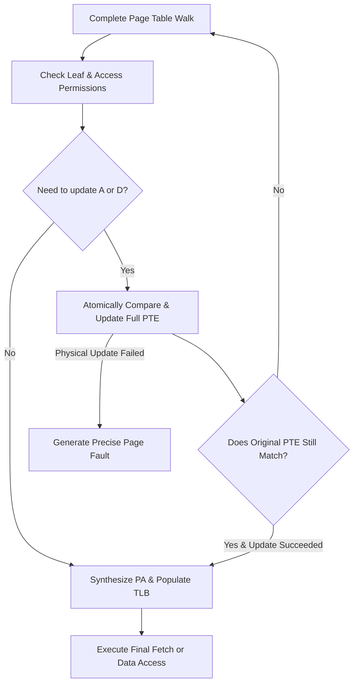

# Memory Management Unit & Sv39 Specification

## 1. Address Types

- Virtual Address (VA) is a 64-bit address produced by CPU.
- Sv39 canonical address requires bits 63:39 to be sign-extended from bit 38; bits 63:39 must all equal bit 38.
- PTE is a 64-bit little-endian value.
- Target physical address capacity is recorded per PRD as 56 bits, but Sv39 PTE expressible range and actual RAM/MMIO addresses must be validated against the frozen privileged spec; accesses exceeding implemented physical address width generate access faults.

## 2. Translation Enablement

- **MMU-REQ-001**: M-mode instruction fetch and normal access default to using physical addresses.
- **MMU-REQ-002**: S/U modes with `satp.MODE=Sv39` require translation for instruction fetch, load, and store.
- **MMU-REQ-003**: Data access in M-mode with `mstatus.MPRV=1` determines translation per effective privilege mode specified by MPP; instruction fetch is unaffected by MPRV.
- **MMU-REQ-004**: Address passes through when `satp.MODE=Bare`, but still undergoes physical bus boundary checks.

## 3. Sv39 Address Decomposition

```text
VA[38:30] = VPN[2]
VA[29:21] = VPN[1]
VA[20:12] = VPN[0]
VA[11:0]  = page offset
```

Root page table physical address is `satp.PPN << 12`. Each level PTE address is current table base plus `VPN[level] × 8`; all additions must check physical address overflow.

## 4. PTE Fields and Validity

Process at least `V/R/W/X/U/G/A/D`, RSW, and PPN. Reserved bits and future extension bits are checked per frozen spec.

- `V=0` indicates invalid PTE.
- `R=0 && W=1` is a reserved illegal combination, generating page faults.
- `R=0 && X=0` points to next-level page table.
- `R=1` or `X=1` indicates a leaf PTE.
- Reaching level 0 without encountering a leaf generates a corresponding page fault.

## 5. Leaf Pages and Superpages

- level 0 leaf maps a 4 KiB page.
- level 1 leaf maps a 2 MiB page; lower level PPN fields in PTE must be zero.
- level 2 leaf maps a 1 GiB page; lower two level PPN fields in PTE must be zero.
- Misaligned superpages generate page faults and must not be automatically aligned.

Physical address synthesis must replace lower PPN bits not provided by PTE with corresponding VPN per leaf level, rather than simply applying `PTE.PPN + 12-bit offset` for all leaves.

## 6. Permission Checks

- **MMU-REQ-005**: Instruction fetch requires X; load requires R, or permits X when MXR=1; store requires R and W.
- **MMU-REQ-006**: U-mode can access leaf PTEs with `U=1` only.
- **MMU-REQ-007**: S-mode must not fetch instructions from U pages; data access to U pages requires `SUM=1`.
- **MMU-REQ-008**: Permission checks evaluate effective privilege mode and access type of initiating access, rather than checking current CPU mode alone.
- If PMP is implemented, page table physical accesses and final physical accesses also pass through PMP; initial release PMP scope must be explicit during standard freeze phase, without falsely claiming full support.

## 7. A/D Bits

Per PRD, this project selects hardware emulation updates:

- Legal access with `A=0` atomically sets A.
- Legal store with `D=0` atomically sets A and D.
- PTE updates must utilize controlled physical atomic read-modify-write, confirming PTE has not changed in between; retry page walk if changed.
- If physical memory hosting PTE is unwritable or update fails, generate matching page fault, without modifying TLB copy alone.
- Permission failures must not update A/D prematurely.

### 7.1 Atomic Update Transactions

- **MMU-REQ-010**: After permission check succeeds, use the full 64-bit PTE read during this walk as the original comparison value.
- **MMU-REQ-011**: Set A/D via the physical bus sole atomic compare-and-update transaction, without simulating atomicity using normal load/store pairs.
- **MMU-REQ-012**: Upon commit, if in-memory PTE no longer matches original value, discard current translation result and re-walk from root page table.
- **MMU-REQ-013**: Synthesize final PA, populate TLB, and execute triggering guest access only after atomic update succeeds.
- **MMU-REQ-014**: Upon update failure, leave no partial bit changes in memory, nor assume A/D is set in TLB entry alone.



Initial single main loop guarantees no host threads mutate architectural memory concurrently, but device DMA, AMOs, page table writes, and future async backends may still alter the same PTE. Therefore, atomic transaction is a formal bus semantic, and cannot omit comparison and retry by assuming "concurrency is unlikely."

## 8. Exception Types

- Non-canonical virtual addresses, invalid PTEs, permission failures, misaligned superpages, and A/D update failures generate instruction/load/store page faults.
- Bus errors encountered during page table physical reads map to matching access faults or page faults per frozen privileged spec, fixed by tests without arbitrary mixing.
- `tval` stores the original virtual address triggering guest access, rather than intermediate PTE address.

## 9. TLB

- **MMU-REQ-009**: At least 64 valid entries, fully-associative or set-associative.
- Entries contain at least virtual page tag, ASID, page size/level, physical page info, global flag, and permission-related PTE bits.
- Hits still evaluate current effective privilege, SUM/MXR, and access type for permissions, or encode these conditions fully into cache keys.
- Supports 4 KiB and superpage matching.
- Replacement algorithm must be deterministic and testable.

## 10. `SFENCE.VMA`

- `rs1=x0, rs2=x0`: Flushes all non-essential retained entries.
- Specified VA: Flushes matching pages covering that address, including superpages.
- Specified ASID: Flushes matching non-global mappings only.
- Global mappings are preserved per spec when only ASID is specified.
- Execution permission and privilege checks must conform to chosen spec version.
- Writing `satp` does not replace fence; software orders per spec.

## 11. Acceptance Criteria

- Covers all page levels, canonical/non-canonical addresses, and superpage alignment.
- Covers U/S/MPRV, SUM, MXR, and R/W/X combinations.
- Verifies real A/D bit writeback to memory and retries on concurrent changes.
- Verifies TLB ASID, global, superpage hits, and all `SFENCE.VMA` combinations.
- Verifies fetch, load, store fault cause, tval, and absence of error side effects.
- Verifies re-walking when PTE is altered prior to atomic commit, without using old permissions or old PPN.
- Verifies absence of illegal side effects in TLB, target memory, or architectural registers when PTE update fails.
- Verifies load sets A only, store sets A/D, and TLB population succeeds later than real PTE writeback.
