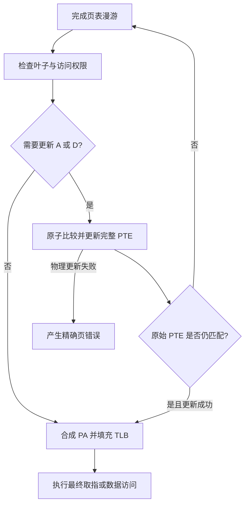

# 内存管理单元与 Sv39 规格

## 1. 地址类型

- 虚拟地址（VA）为 CPU 产生的 64 位地址。
- Sv39 有效地址由 39 位有效值符号扩展到 64 位；位 63:39 必须全部等于位 38。
- PTE 为 64 位小端值。
- 目标物理地址能力按 PRD 记录为 56 位，但 Sv39 PTE 可表达范围和实际 RAM/MMIO 地址必须依据冻结的特权规范校验；超出实现物理地址宽度的访问产生访问错误。

## 2. 翻译启用

- **MMU-REQ-001**：M 模式取指和普通访问默认使用物理地址。
- **MMU-REQ-002**：S/U 模式且 `satp.MODE=Sv39` 时，取指、加载和存储必须翻译。
- **MMU-REQ-003**：M 模式在 `mstatus.MPRV=1` 的数据访问按 MPP 指定的有效特权级决定翻译；取指不受 MPRV 影响。
- **MMU-REQ-004**：`satp.MODE=Bare` 时地址直通，但仍通过物理总线边界检查。

## 3. Sv39 地址分解

```text
VA[38:30] = VPN[2]
VA[29:21] = VPN[1]
VA[20:12] = VPN[0]
VA[11:0]  = page offset
```

根页表物理地址为 `satp.PPN << 12`。每级 PTE 地址为当前表基址加 `VPN[level] × 8`，所有加法都必须检查物理地址溢出。

## 4. PTE 字段与有效性

至少处理 `V/R/W/X/U/G/A/D`、RSW 和 PPN。保留位及未来扩展位按冻结规范检查。

- `V=0` 为无效 PTE。
- `R=0 && W=1` 为保留非法组合，产生页错误。
- `R=0 && X=0` 表示指向下一级页表。
- `R=1` 或 `X=1` 表示叶子。
- 到 level 0 仍未遇到叶子，产生相应页错误。

## 5. 叶子页与超级页

- level 0 叶子映射 4 KiB 页面。
- level 1 叶子映射 2 MiB 页面，PTE 的低一级 PPN 字段必须为零。
- level 2 叶子映射 1 GiB 页面，PTE 的低两级 PPN 字段必须为零。
- 错位超级页产生页错误，不得自动对齐。

物理地址合成必须按叶子级别将未由 PTE 提供的低位 PPN 替换为对应 VPN，不能对所有叶子简单使用 `PTE.PPN + 12 位 offset`。

## 6. 权限检查

- **MMU-REQ-005**：取指要求 X；加载要求 R，或在 MXR=1 时允许 X；存储要求 R 与 W。
- **MMU-REQ-006**：U 模式只可访问 `U=1` 的叶子。
- **MMU-REQ-007**：S 模式不得从 U 页取指；数据访问 U 页要求 `SUM=1`。
- **MMU-REQ-008**：权限判断使用发起访问的有效特权级和访问类型，不能只检查当前 CPU 模式。
- 若实现 PMP，页表物理访问和最终物理访问还需经过 PMP；首版 PMP 范围必须在标准冻结阶段明确，不能虚假宣称完整支持。

## 7. A/D 位

依据 PRD，本项目选择模拟硬件更新：

- 合法访问且 `A=0` 时，原子设置 A。
- 合法存储且 `D=0` 时，原子设置 A 和 D。
- PTE 更新必须采用受控物理原子读改写，并确认 PTE 未在期间变化；变化时重试漫游。
- PTE 所在物理内存不可写或更新失败时，产生对应页错误，不得只修改 TLB 副本。
- 权限失败时不得先更新 A/D。

### 7.1 原子更新事务

- **MMU-REQ-010**：权限检查成功后，使用本次漫游读到的完整 64 位 PTE 作为原始比较值。
- **MMU-REQ-011**：通过物理总线唯一的原子比较并更新事务设置 A/D，不得以普通 load/store 对模拟原子性。
- **MMU-REQ-012**：提交时若内存中的 PTE 已不等于原始值，必须丢弃当前翻译结果并从根页表重新漫游。
- **MMU-REQ-013**：只有原子更新成功后才可合成最终 PA、填充 TLB 并执行引起来宾访问。
- **MMU-REQ-014**：更新失败时不得在内存中留下部分位变化，也不得只在 TLB 条目中假定 A/D 已设置。



首版单主循环可以保证没有宿主线程同时修改架构内存，但设备 DMA、AMO、页表写入与未来异步后端仍可能改变同一 PTE。因此原子事务是总线的正式语义，不能依赖“当前大概没有并发”而省略比较和重试。

## 8. 异常类型

- 非规范虚拟地址、无效 PTE、权限失败、错位超级页和 A/D 更新失败产生 instruction/load/store page fault。
- 页表自身物理读取遇到总线错误时，按照冻结的特权规范映射到相应访问错误或页错误，并用测试固定；不得随意混用。
- `tval` 保存引起来宾访问的原始虚拟地址，而不是中间 PTE 地址。

## 9. TLB

- **MMU-REQ-009**：至少 64 个有效条目，可全关联或组关联。
- 条目至少包含虚拟页标签、ASID、页大小/级别、物理页信息、全局标志和权限相关 PTE 位。
- 命中时仍需结合当前有效特权、SUM/MXR 和访问类型判断权限，或将这些条件完整编码进缓存键。
- 支持 4 KiB 和超级页匹配。
- 替换算法必须确定且可测试。

## 10. `SFENCE.VMA`

- `rs1=x0, rs2=x0`：刷新全部非必要保留条目。
- 指定 VA：刷新覆盖该地址的匹配页面，包括超级页。
- 指定 ASID：仅刷新对应非全局映射。
- 全局映射在仅指定 ASID 的刷新中按规范保留。
- 执行权限和特权检查必须符合所选规范版本。
- 写 `satp` 不代替 fence；软件负责按规范排序。

## 11. 验收条件

- 覆盖所有页级别、规范/非规范地址和超级页对齐。
- 覆盖 U/S/MPRV、SUM、MXR 与 R/W/X 组合。
- 验证 A/D 位真实写回内存和并发变化重试。
- 验证 TLB ASID、global、超级页命中与全部 `SFENCE.VMA` 组合。
- 分别验证取指、加载、存储故障的 cause、tval 和无错误副作用。
- 验证原子提交前 PTE 被更改时重新漫游，不使用旧权限或旧 PPN。
- 验证 PTE 更新失败时 TLB、目标内存和架构寄存器均无非法副作用。
- 验证加载只置 A、存储置 A/D，且 TLB 填充晚于真实 PTE 写回。
