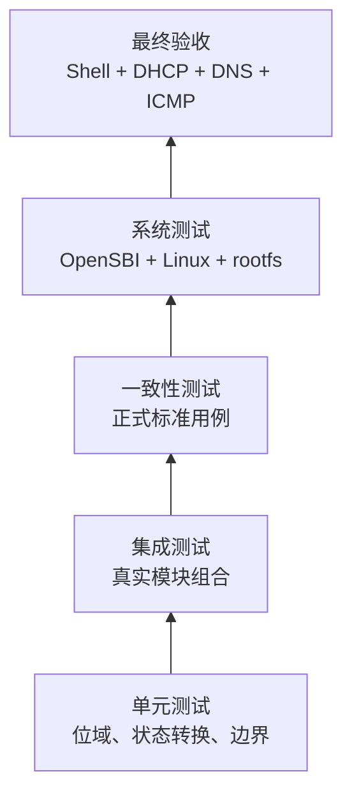

# 测试、验证与验收规格

## 1. 测试原则

- **TEST-REQ-001**：测试必须验证生产实现，不得复制一套译码器、MMU 或设备逻辑作为被测替代品。
- **TEST-REQ-002**：每个强制需求至少对应一种可复核验证方法。
- **TEST-REQ-003**：所有测试命令、输入、版本和结果必须可记录、可重复。
- **TEST-REQ-004**：Mock 不能作为最终功能完成证据；真实模块组合和真实系统链路不可省略。
- **TEST-REQ-005**：失败、跳过和未执行必须分别如实报告。

## 2. 分层策略

上层通过不取消下层要求，下层通过也不能推断上层成功。

## 3. 单元测试

### 3.1 CPU 与 ISA

- 每个指令编码、寄存器结果、PC、异常和非法组合。
- x0 写保护、符号/零扩展、移位边界、32 位结果符号扩展。
- 除零、乘除溢出、浮点舍入、NaN boxing 和异常标志。
- LR/SC 保留成功、失败和各种失效事件。

### 3.2 CSR 与 Trap

- CSR 权限、只读、WARL、别名和条件写。
- M/S/U Trap 入口、委托、优先级和 xRET。
- Direct/Vectored `tvec` 以及 status 中断栈。

### 3.3 MMU

- 规范地址、三级漫游、4 KiB/2 MiB/1 GiB 页面。
- 每种 PTE 非法组合、权限矩阵、SUM/MXR/MPRV。
- A/D 原子写回、TLB 标签、ASID/global 和 `SFENCE.VMA`。

### 3.4 RVV

- 所有 SEW/LMUL、`VLMAX/vl/vtype`。
- 掩码、tail、prestart、寄存器组与重叠。
- 非对齐和跨页访存、中途异常、`vstart` 重启。
- 整数除法边界和浮点 flags 累积。

### 3.5 设备

- 每个 MMIO 寄存器宽度、复位、读写副作用。
- CLINT/PLIC 电平与 claim/complete。
- VirtIO 状态机、描述符恶意输入、ring 回绕和中断确认。

## 4. 集成测试

- CPU + MMU + Bus：真实编码执行虚拟访存并进入 Trap。
- CPU + CLINT/PLIC：指令运行期间注入真实设备中断。
- UART + terminal 后端：使用伪终端验证 Raw 字节语义，但最终仍需真实终端验收。
- VirtIO-Blk + RAM + 临时真实镜像文件：验证完整请求和持久化。
- VirtIO-Net + TAP：在隔离网络命名空间或经确认环境验证真实以太网包；内存队列伪造不能替代此测试。
- Boot loader + FDT：使用正式 FDT 工具解析生成结果。

测试使用的临时资源必须受控、可清理，并不得修改用户现有网络或镜像。

## 5. 一致性测试

- 使用与冻结 ISA 版本一致的 RISC-V 架构测试。
- 使用明确版本的 RVV 1.0 测试集。
- 必要时使用 SoftFloat 或正式参考向量验证浮点边界，但实际生产执行路径仍是被测对象。
- VirtIO 行为对照冻结版规范与真实 Linux 驱动。
- 记录测试仓库 URL、commit、配置、许可证和本地相对输出路径。

参考模型只产生期望结果，不能在运行时替代模拟器执行。

## 6. 系统启动阶段门

### Gate 1：OpenSBI

- 真实固件开始执行并输出 Banner。
- 平台、Hart、ISA、下一阶段地址与 FDT 可识别。
- 无人为打印或预录输出。

### Gate 2：Linux 早期启动

- 内核取得控制权，初始化 MMU、Trap、时钟与 PLIC。
- 内存大小、CPU ISA 和设备树与机器一致。
- 无非法指令循环、页错误循环或早期 panic。

### Gate 3：存储与用户空间

- VirtIO-Blk 由真实 Linux 驱动初始化。
- ext4 rootfs 按指定设备挂载。
- init 完成并进入可交互 Shell。
- macOS 无网络档位必须在该真实 Shell 中成功执行 `ls /`、`pwd` 和 `cat /proc/cpuinfo`。

### Gate 4：网络

- 本 Gate 仅适用于 Linux TAP 网络档位，不阻止 macOS 在 Gate 3 形成独立、可记录的本地启动验收。
- VirtIO-Net 被识别为 `eth0`。
- DHCP、ARP、路由和 DNS 均由真实包链路完成。
- 公网 ICMP 达到最终标准。

## 7. 最终验收记录

验收记录至少包含：

- 宿主操作系统版本和 CPU 架构；Linux 网络档位还记录发行版与宿主内核版本。
- 编译器、CMake、OpenSBI、Linux、rootfs 版本与 SHA-256。
- 来宾内核配置和启动命令。
- Linux 网络档位记录 TAP/bridge/NAT 拓扑；macOS 档位明确记录 `--net none`。
- 完整 UART 日志和关键宿主诊断。
- `ip addr`、`ip route`、resolver 状态、DHCP 输出和 `ping` 输出。
- 测试日期，以及任何外部网络条件。

记录放在 `artifacts/logs/` 等被忽略目录；可提交的仅为去敏后的模板或摘要。

## 8. 最终成功判定

只有同时满足以下条件才可宣布 PRD 完成：

1. 所有强制需求均有实现与验证映射。
2. 必需单元、集成和一致性测试全部通过，无未解释跳过。
3. macOS 无网络档位真实运行 OpenSBI、Linux、ext4 Shell，并执行三条规定的基础命令。
4. Linux 网络档位真实运行相同启动链路，并执行 `dhclient eth0` 成功。
5. Linux 来宾执行 `ping -c 4 google.com` 收到 4 个响应且 0% 丢包。
6. 无 Mock、固定输出、宿主代执行或多套简化逻辑参与验收。
7. 终端和实际启用的宿主网络状态安全恢复。

环境导致最后一步暂时不可完成时，项目状态是“受阻/未验收”，不是“近似完成”。
