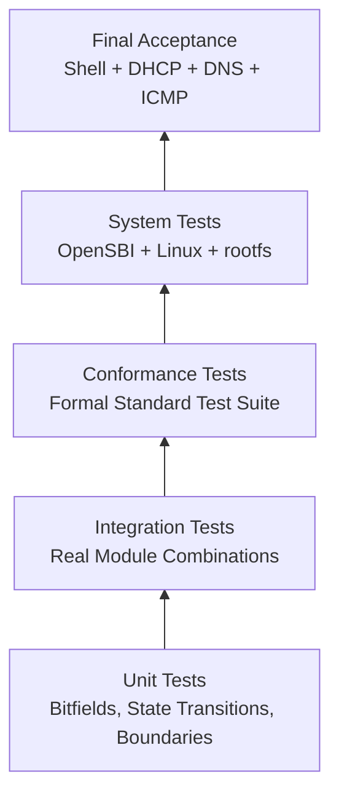

# Testing, Verification & Acceptance Specification

## 1. Testing Principles

- **TEST-REQ-001**: Tests must verify production implementations, and must not copy a set of decoders, MMU, or device logic as test doubles.
- **TEST-REQ-002**: Every mandatory requirement corresponds to at least one verifiable verification method.
- **TEST-REQ-003**: All test commands, inputs, versions, and results must be recordable and reproducible.
- **TEST-REQ-004**: Mocks cannot serve as evidence of final feature completion; real module combinations and real system links cannot be omitted.
- **TEST-REQ-005**: Failures, skips, and unexecuted checks must be reported truthfully.

## 2. Layering Strategy

Upper layers passing does not cancel lower-layer requirements; lower layers passing cannot infer upper-layer success.

## 3. Unit Testing

### 3.1 CPU and ISA

- Every instruction encoding, register result, PC, exception, and illegal combination.
- x0 write protection, sign/zero extension, shift boundaries, 32-bit result sign extension.
- Divide by zero, multiply/divide overflow, FP rounding, NaN boxing, and exception flags.
- LR/SC reservation success, failure, and various invalidation events.

### 3.2 CSR and Trap

- CSR permissions, read-only, WARL, aliases, and conditional writes.
- M/S/U Trap entry, delegation, priority, and xRET.
- Direct/Vectored `tvec` and status interrupt stacks.

### 3.3 MMU

- Canonical addresses, 3-level walks, 4 KiB / 2 MiB / 1 GiB pages.
- Every PTE illegal combination, permission matrix, SUM/MXR/MPRV.
- Atomic A/D writeback, TLB tags, ASID/global, and `SFENCE.VMA`.

### 3.4 RVV

- All SEW/LMUL, `VLMAX/vl/vtype`.
- Mask, tail, prestart, register groups, and overlaps.
- Unaligned and page-crossing accesses, mid-way exceptions, `vstart` restarts.
- Integer division boundaries and FP flags accumulation.

### 3.5 Devices

- Every MMIO register width, reset, read/write side effects.
- CLINT/PLIC level lines and claim/complete.
- VirtIO state machine, descriptor malicious inputs, ring wraparounds, and interrupt ACKs.

## 4. Integration Testing

- CPU + MMU + Bus: Real instruction encodings executing virtual memory accesses and entering Traps.
- CPU + CLINT/PLIC: Injecting real device interrupts during instruction execution.
- UART + terminal backend: Verifying Raw byte semantics using pseudo-terminals, though final acceptance still requires real terminals.
- VirtIO-Blk + RAM + temporary real image file: Verifying full requests and persistence.
- VirtIO-Net + TAP: Verifying real Ethernet packets in an isolated network namespace or confirmed environment; memory queue faking cannot replace this test.
- Boot loader + FDT: Parsing generated output using formal FDT tools.

Temporary resources used by tests must be controlled, cleanup-able, and must not modify user existing networks or disk images.

## 5. Conformance Testing

- Use RISC-V architecture test suites consistent with frozen ISA versions.
- Use explicit version RVV 1.0 test sets.
- Use SoftFloat or formal reference vectors when necessary to verify floating-point boundaries, though the actual production execution path remains the test object.
- VirtIO behavior checked against frozen specification versions and real Linux drivers.
- Record test repository URL, commit, configuration, license, and local relative output paths.

Reference models produce expected results only, and cannot replace the emulator execution at runtime.

## 6. System Boot Stage Gates

### Gate 1: OpenSBI

- Real firmware starts execution and outputs Banner.
- Platform, Hart, ISA, next-stage address, and FDT are recognized.
- No artificial prints or pre-recorded outputs.

### Gate 2: Linux Early Boot

- Kernel gains control, initializing MMU, Trap, clocks, and PLIC.
- Memory size, CPU ISA, and device tree match machine layout.
- No illegal instruction loops, page fault loops, or early panics.

### Gate 3: Storage and Userspace

- VirtIO-Blk initialized by real Linux driver.
- ext4 rootfs mounted according to designated device.
- init completes and enters an interactive Shell.
- macOS non-networked profile must successfully execute `ls /`, `pwd`, and `cat /proc/cpuinfo` in this real Shell.

### Gate 4: Networking

- This Gate applies strictly to Linux TAP network profile, and does not block macOS from establishing independent, recordable local boot acceptance at Gate 3.
- VirtIO-Net detected as `eth0`.
- DHCP, ARP, routing, and DNS completed over real packet links.
- Public ICMP reaches final standards.

## 7. Final Acceptance Logging

Acceptance logs contain at least:

- Host OS version and CPU architecture; Linux network profile also records distribution and host kernel version.
- Compiler, CMake, OpenSBI, Linux, rootfs versions and SHA-256 hashes.
- Guest kernel configuration and boot command lines.
- Linux network profile records TAP/bridge/NAT topology; macOS profile explicitly records `--net none`.
- Complete UART logs and key host diagnostics.
- `ip addr`, `ip route`, resolver status, DHCP output, and `ping` output.
- Test date, and any external network conditions.

Logs are stored in ignored directories such as `artifacts/logs/`; committable entries are sanitized templates or summaries only.

## 8. Final Success Judgement

Declare PRD complete only when all of the following conditions are simultaneously met:

1. All mandatory requirements have implementation and verification mappings.
2. Mandatory unit, integration, and conformance tests all pass without unexplained skips.
3. macOS non-networked profile genuinely runs OpenSBI, Linux, ext4 Shell, executing three specified basic commands.
4. Linux network profile genuinely runs identical boot chain, executing `dhclient eth0` successfully.
5. Linux guest executes `ping -c 4 google.com` receiving 4 replies with 0% packet loss.
6. No Mocks, fixed outputs, host execution on behalf of guest, or multiple simplified logic sets participate in acceptance.
7. Terminal and actually enabled host network states are safely restored.

When environment temporary prevents completing the final step, project status is "Blocked / Unaccepted", not "Nearly Complete".
