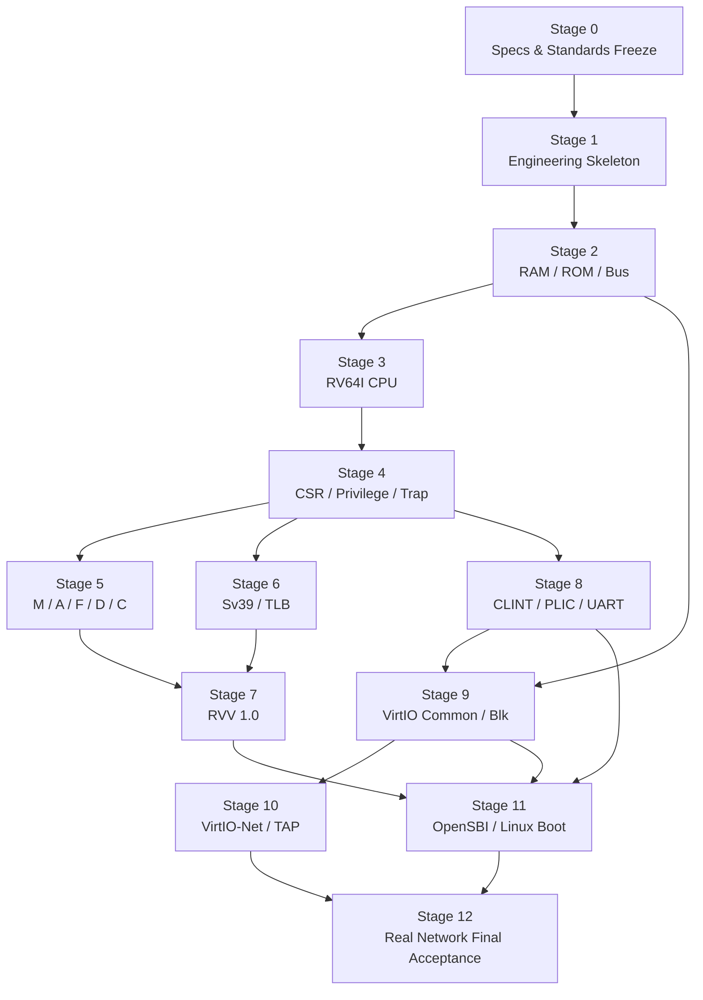

# Implementation Roadmap

## 1. Roadmap Principles

The roadmap defines only dependencies and stage gates, and does not authorize code modifications, command execution, downloads, or Git operations. Before starting each stage, explanations and user confirmation per `AGENTS.md` are still required. Bypassing prerequisite semantics to observe Linux boot logs sooner is prohibited.

## 2. Stage Dependencies

Parallel arrows indicate technical dependency allowance only, and do not authorize using multiple Agents or parallel modifications of shared files.

## 3. Stage 0: Specs & Standards Freeze

### Deliverables

- User confirms all `specs/` documents.
- Freeze RISC-V, RVV, and VirtIO standard versions.
- Freeze single hart, timing model, scalar unaligned access policy, and PMP scope.
- Freeze OpenSBI, Linux LTS, rootfs, and toolchain versions.
- Complete requirement-task-test traceability matrix.

### Exit Conditions

No unresolved architecture-impacting issues; `SDD-001..004` all have confirmations and evidence.

## 4. Stage 1: Engineering Skeleton

Establish C++ build system, module interfaces, error types, test entries, and external artifact ignore policies. This stage puts no fake CPU or banner-printing firmware demos in place.

### Exit Conditions

Strict warning build passes; directory layout matches `project-tree.md`; all added code meets Chinese annotation standards; test framework runs real empty test lists without claiming hardware features complete.

## 5. Stage 2: Physical Memory & Bus

Complete RAM, ROM, MMIO registration, structured bus errors, and DMA boundaries first before CPU or devices are allowed to depend on them.

### Exit Conditions

All address map boundaries, widths, read-only, unmapped, overflow, and atomic transaction tests pass, with no bypass entries.

## 6. Stage 3: RV64I CPU

Establish sole fetch/decode/execute path, completing RV64I and basic synchronous exceptions. Test using real encodings without building a secondary decoder for testing.

### Exit Conditions

RV64I instruction family, 16/32-bit length identification foundation, PC, and precise exception tests pass.

## 7. Stage 4: CSR, Privilege & Trap

Implement CSR tables, aliases, M/S/U, delegation, interrupt selection, Trap entry, and xRET.

### Exit Conditions

Exception/interrupt round trips originating from all three privilege levels work correctly, status fields do not fork, and illegal CSR accesses are precise.

## 8. Stage 5: M/A/F/D/C

Implement standard extensions one by one and pass matching conformance tests. Extensions are advertised in `misa` and FDT only when fully complete.

### Exit Conditions

Divide-by-zero, overflow, LR/SC invalidations, AMO atomicity, rounding/NaN, and all legal compressed encodings have logged evidence.

## 9. Stage 6: Sv39 & TLB

Implement page table walks, superpages, permissions, A/D, TLB, and `SFENCE.VMA`, attaching to the sole entry point for instruction fetch and data access.

### Exit Conditions

All page sizes and permission matrices pass; TLB does not alter architectural results; page fault cause/tval are precise.

## 10. Stage 7: RVV 1.0

Complete state, config, integer, floating-point, mask, and memory access per `04-vector-extension-rvv.md`, without bypassing element semantics via host SIMD.

### Exit Conditions

Declared scope is fully implemented, passing RVV conformance, mask/tail, overlap, page-crossing, and exception restart tests.

## 11. Stage 8: CLINT, PLIC & UART

Implement real MMIO state, interrupt lines, and terminal backend, providing timing and console for OpenSBI/Linux.

### Exit Conditions

Timer, software/external interrupts, and real terminal byte interactions are stable; all exit paths restore terminal.

## 12. Stage 9: VirtIO Common Layer & Block Device

Complete reusable transport/virtqueue first before connecting block backend. Do not duplicate queue parsing for network cards.

### Exit Conditions

Malicious descriptor safety tests pass; real ext4 images read and write stably via complete VirtIO-Blk requests.

## 13. Stage 10: VirtIO-Net & TAP

Attach RX/TX at the common VirtIO layer, completing non-blocking TAP, backpressure, packet boundaries, and PLIC interrupts.

### Exit Conditions

Isolated real TAP tests for ARP, IPv4, and bidirectional packet flows pass; resources and host networks clean up safely.

## 14. Stage 11: OpenSBI, Linux & rootfs

Obtain/build real software per external artifact policy, generate FDT, and gate-by-gate verify firmware, kernel, block device, and Shell.

### Exit Conditions

OpenSBI Banner, Linux panic-free boot, ext4 root mount, and interactive Shell all have complete log evidence.

## 15. Stage 12: Real Network Final Acceptance

Prepare host TAP/bridge/NAT upon user confirmation, executing DHCP, DNS, and ICMP in guest.

### Exit Conditions

`dhclient eth0` succeeds, `ping -c 4 google.com` receives 4 replies with 0% packet loss; complete logs are verifiable without Mocks, host execution on behalf of guest, or faking.

## 16. Deviation Handling

When upstream semantic errors are discovered at any stage:

1. Stop downstream extensions.
2. Record affected requirements, tasks, and tests.
3. Explain plans and impacts for correcting spec or implementation to user.
4. Repair sole authoritative path via patch upon confirmation.
5. Re-run all affected real tests.

Adding bypass logic to maintain superficial progress is prohibited.
