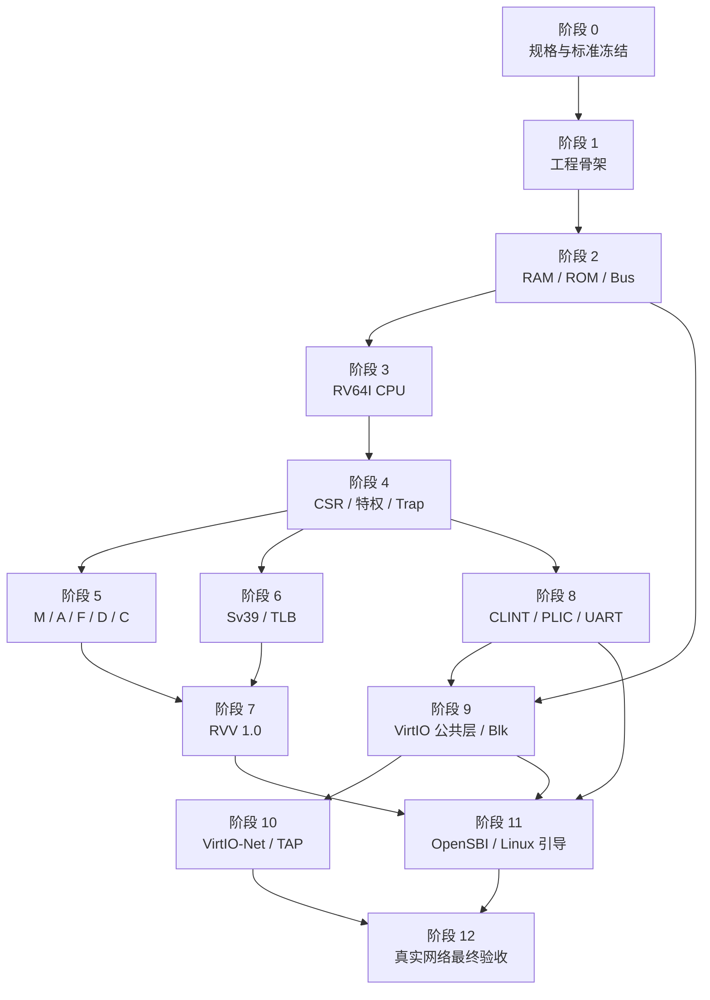

# 实施路线图

## 1. 路线原则

路线图只定义依赖和阶段门，不授权修改代码、执行命令、下载或 Git 操作。每个阶段开始前仍需按 `AGENTS.md` 说明并取得确认。不能为了尽快看到 Linux 日志绕过前置语义。

## 2. 阶段依赖

并行箭头仅表示技术依赖允许，不授权使用多 Agent 或并行修改共享文件。

## 3. 阶段 0：规格与标准冻结

### 交付物

- 用户确认全部 `specs/` 文档。
- 冻结 RISC-V、RVV、VirtIO 标准版本。
- 冻结单 Hart、计时模型、标量非对齐策略和 PMP 范围。
- 冻结 OpenSBI、Linux LTS、rootfs 和工具链版本。
- 完成需求—任务—测试追踪矩阵。

### 退出条件

没有影响架构的未决问题；`SDD-001..004` 均有确认和证据。

## 4. 阶段 1：工程骨架

建立 C++ 构建、模块接口、错误类型、测试入口和外部产物忽略策略。此阶段不放入假 CPU 或打印式固件演示。

### 退出条件

严格告警构建通过；目录与 `project-tree.md` 一致；所有新增代码满足中文注释规范；测试框架运行真实空测试清单但不声称硬件功能完成。

## 5. 阶段 2：物理内存与总线

先完成 RAM、ROM、MMIO 注册、结构化总线错误和 DMA 边界，再允许 CPU 或设备依赖它。

### 退出条件

地址图所有边界、宽度、只读、未映射、溢出和原子事务测试通过，无旁路入口。

## 6. 阶段 3：RV64I CPU

建立唯一取指/译码/执行路径，完成 RV64I 和基本同步异常。使用真实编码测试，不建立仅供测试的第二译码器。

### 退出条件

RV64I 指令族、16/32 位长度识别基础、PC 与精确异常测试通过。

## 7. 阶段 4：CSR、特权与 Trap

实现 CSR 表、别名、M/S/U、委托、中断选择、Trap 入口及 xRET。

### 退出条件

从三种特权级发起的异常/中断往返正确，状态字段无分叉，非法 CSR 访问精确。

## 8. 阶段 5：M/A/F/D/C

按正式扩展逐一实现并通过对应一致性测试。只有某扩展完整时才在 `misa` 和 FDT 中公布。

### 退出条件

除零、溢出、LR/SC 失效、AMO 原子、舍入/NaN、全部合法压缩编码均有证据。

## 9. 阶段 6：Sv39 与 TLB

实现页表漫游、超级页、权限、A/D、TLB 与 `SFENCE.VMA`，接入取指和数据访问的唯一入口。

### 退出条件

所有页面尺寸和权限矩阵通过；TLB 不改变架构结果；页错误 cause/tval 精确。

## 10. 阶段 7：RVV 1.0

按 `04-vector-extension-rvv.md` 完成状态、配置、整数、浮点、掩码和访存，不通过宿主 SIMD 绕过元素语义。

### 退出条件

声明范围全部实现并通过 RVV 一致性、mask/tail、重叠、跨页和异常重启测试。

## 11. 阶段 8：CLINT、PLIC 与 UART

实现真实 MMIO 状态、中断线路和终端后端，为 OpenSBI/Linux 提供计时与控制台。

### 退出条件

定时器、软件/外部中断和真实终端字节交互稳定；所有退出路径恢复终端。

## 12. 阶段 9：VirtIO 公共层与块设备

先完成可复用 transport/virtqueue，再接块后端。不得为网卡复制队列解析。

### 退出条件

恶意描述符安全测试通过；真实 ext4 镜像可由完整 VirtIO-Blk 请求稳定读取和写入。

## 13. 阶段 10：VirtIO-Net 与 TAP

在公共 VirtIO 层接入 RX/TX，完成非阻塞 TAP、背压、包边界和 PLIC 中断。

### 退出条件

隔离真实 TAP 测试中 ARP、IPv4 和双向包流通过，资源与宿主网络安全清理。

## 14. 阶段 11：OpenSBI、Linux 与 rootfs

按外部产物策略获取/构建真实软件，生成 FDT，逐门验证固件、内核、块设备和 Shell。

### 退出条件

OpenSBI Banner、Linux 无 panic 启动、ext4 根挂载和交互式 Shell 均有完整日志证据。

## 15. 阶段 12：最终网络验收

经用户确认准备宿主 TAP/bridge/NAT，在来宾中执行 DHCP、DNS 和 ICMP。

### 退出条件

`dhclient eth0` 成功，`ping -c 4 google.com` 获得 4 个响应且 0% 丢包；完整记录可复核且无 Mock、代执行或伪造。

## 16. 偏差处理

任何阶段发现上游语义错误时：

1. 停止下游扩展。
2. 记录受影响需求、任务和测试。
3. 向用户说明修正规格或实现的方案与影响。
4. 获得确认后用补丁修复唯一权威路径。
5. 重跑所有受影响的真实测试。

禁止新增旁路逻辑维持表面进度。
