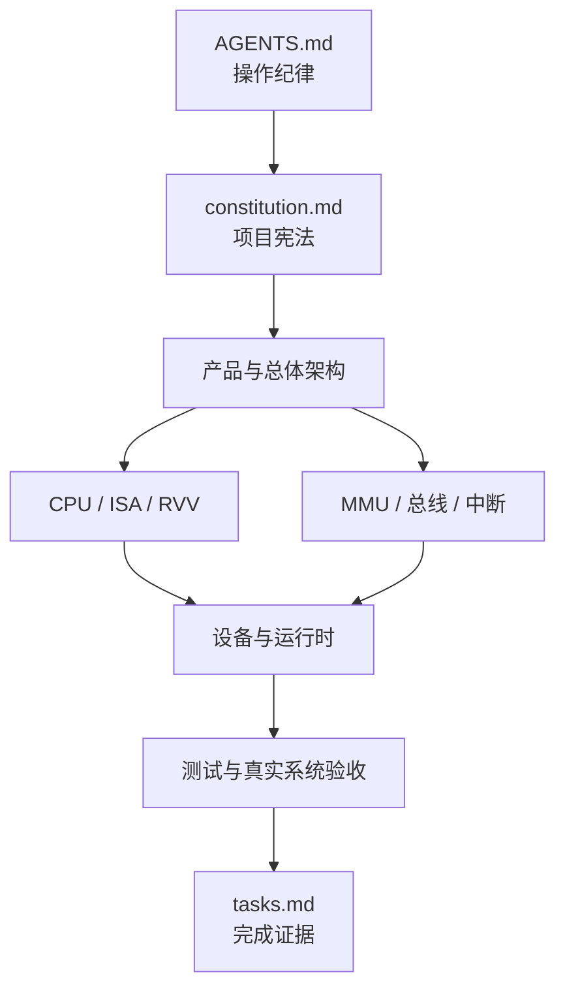

# `homemade-risc-v-64-vector-linux-emulator` 规格总览

## 1. 文档目的

本目录是项目的权威规格集合，用于约束设计、实现、测试和最终验收。项目采用 SDD：先明确可验证的需求，再按依赖顺序实施，不允许以临时代码、Mock 或快速验证替代正式功能。

## 2. 阅读顺序

1. 阅读根目录 `AGENTS.md`，了解所有操作纪律。
2. 阅读 `constitution.md`，了解不可违反的工程原则。
3. 阅读 `00-product-overview.md` 和 `01-architecture.md`，建立系统整体模型。
4. 按 CPU、内存、总线、外设、运行时的顺序阅读专题规格。
5. 阅读 `16-testing-verification.md`，确认每项需求如何被验证。
6. 依据 `tasks.md` 的依赖顺序开展工作。



## 3. 文档索引

| 文件 | 主题 | 主要需求域 |
| --- | --- | --- |
| `constitution.md` | 项目宪法 | 治理、质量和禁止事项 |
| `project-tree.md` | 目标项目树 | 模块边界和文件职责 |
| `tasks.md` | 可勾选任务 | 实施顺序和完成证据 |
| `00-product-overview.md` | 产品总览 | 范围、目标和最终验收 |
| `01-architecture.md` | 总体架构 | 组件、依赖和数据流 |
| `02-cpu-privilege-csr.md` | CPU 与 CSR | 寄存器、特权态和陷阱状态 |
| `03-instruction-set.md` | 标量指令集 | RV64I/M/A/F/D/C |
| `04-vector-extension-rvv.md` | RVV 1.0 | VLEN、向量状态和指令 |
| `05-memory-mmu-sv39.md` | MMU | Sv39、权限、A/D 位和 TLB |
| `06-bus-mmio.md` | 总线 | RAM、ROM 和 MMIO 分发 |
| `07-interrupt-clint-plic.md` | 中断 | CLINT、PLIC 和注入流程 |
| `08-uart-console.md` | 控制台 | 16550A、Raw 模式和恢复 |
| `09-virtio-common.md` | VirtIO 公共层 | MMIO 传输和 Virtqueue |
| `10-virtio-block.md` | 块设备 | 扇区请求和镜像一致性 |
| `11-virtio-network.md` | 网卡 | 收发队列、TAP 和中断 |
| `12-boot-firmware-linux.md` | 引导 | OpenSBI、Linux 和 FDT |
| `13-cli-runtime.md` | 运行时 | CLI、主循环和退出策略 |
| `14-host-network-setup.md` | 宿主网络 | TAP、网桥和真实公网链路 |
| `15-error-trap-handling.md` | 错误与陷阱 | 异常编码、委托和返回 |
| `16-testing-verification.md` | 测试 | 分层验证和端到端验收 |
| `17-coding-standards.md` | 编码规范 | C++、SOLID/DRY 和中文注释 |
| `18-dependency-artifact-policy.md` | 产物策略 | 下载、校验、许可证和忽略规则 |
| `19-implementation-roadmap.md` | 路线图 | 阶段依赖和完成定义 |

## 4. 需求标识与追踪

专题规格中的强制要求使用稳定前缀，例如 `CPU-REQ-001`、`MMU-REQ-001`、`VIO-REQ-001`。`tasks.md` 中的任务必须引用相关需求编号，测试记录也必须引用相同编号，从而形成：

```text
产品目标 -> 专题需求 -> 实施任务 -> 测试用例 -> 验收证据
```

编号一旦进入实现不得随意复用。废弃需求应保留编号并注明替代项。

## 5. 规范性用语

- “必须”：不可省略的交付要求。
- “禁止”：任何实现不得采用的行为。
- “应该”：除非有记录充分的原因，否则应满足。
- “可以”：允许但不强制的选择。

当本文档集合与 RISC-V、VirtIO 或 UART 标准发生冲突时，应先记录冲突并更新规格，不能静默选择更方便的实现。

## 6. 当前阶段

当前仅定义 SDD 文档，不代表任何代码、依赖、镜像、测试或网络链路已经完成。所有任务初始均为未完成状态。
