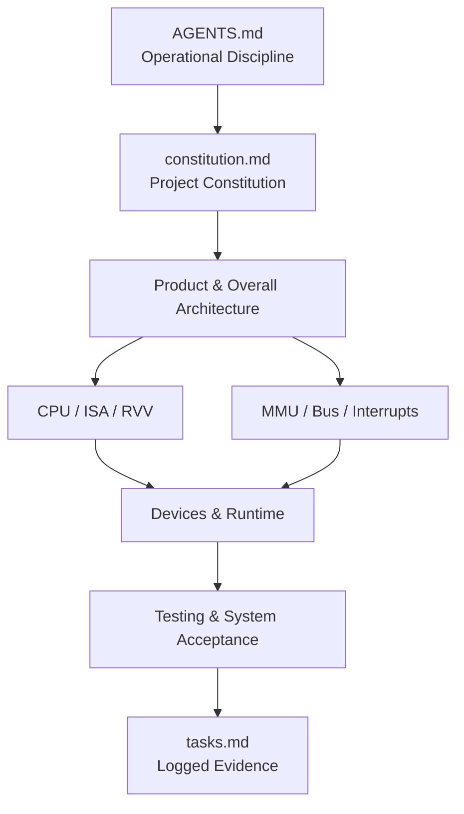

# `homemade-risc-v-64-vector-linux-emulator` Specification Overview

## 1. Document Purpose

This directory serves as the authoritative collection of specifications for the project, constraining design, implementation, testing, and final acceptance. The project adopts SDD: establishing verifiable requirements first, followed by sequential implementation per dependencies, disallowing temporary code, Mocks, or quick smoke tests as substitutes for formal capabilities.

## 2. Reading Sequence

1. Read repository root `AGENTS.md` to understand all operational disciplines.
2. Read `constitution.md` to understand non-negotiable engineering principles.
3. Read `00-product-overview.md` and `01-architecture.md` to establish overall system models.
4. Read specialized specifications in order of CPU, Memory, Bus, Peripherals, and Runtime.
5. Read `16-testing-verification.md` to confirm how each requirement is verified.
6. Carry out work according to dependency sequences in `tasks.md`.



## 3. Document Index

| File | Topic | Primary Requirement Domains |
| --- | --- | --- |
| `constitution.md` | Project Constitution | Governance, Quality, and Prohibited Items |
| `project-tree.md` | Target Project Tree | Module Boundaries and File Duties |
| `tasks.md` | Checkable Tasks | Implementation Sequence and Completion Evidence |
| `standards-baseline.md` | Standard Version Baseline | RISC-V, RVV, and VirtIO Version Freezes |
| `00-product-overview.md` | Product Overview | Scope, Objectives, and Final Acceptance |
| `01-architecture.md` | Overall Architecture | Components, Dependencies, and Data Flows |
| `02-cpu-privilege-csr.md` | CPU and CSRs | Registers, Privilege Modes, and Trap States |
| `03-instruction-set.md` | Scalar Instruction Set | RV64I/M/A/F/D/C |
| `04-vector-extension-rvv.md` | RVV 1.0 | VLEN, Vector State, and Instructions |
| `05-memory-mmu-sv39.md` | MMU | Sv39, Permissions, A/D Bits, and TLB |
| `06-bus-mmio.md` | Bus | RAM, ROM, and MMIO Dispatch |
| `07-interrupt-clint-plic.md` | Interrupts | CLINT, PLIC, and Injection Flows |
| `08-uart-console.md` | Console | 16550A, Raw Mode, and Restoration |
| `09-virtio-common.md` | VirtIO Common Layer | MMIO Transport and Virtqueue |
| `10-virtio-block.md` | Block Device | Sector Requests and Image Consistency |
| `11-virtio-network.md` | Network Card | RX/TX Queues, TAP, and Interrupts |
| `12-boot-firmware-linux.md` | Booting | OpenSBI, Linux, and FDT |
| `13-cli-runtime.md` | Runtime | CLI, Main Loop, and Exit Policies |
| `14-host-network-setup.md` | Host Network | TAP, Bridge, and Real Public Links |
| `15-error-trap-handling.md` | Errors and Traps | Exception Encodings, Delegation, and Returns |
| `16-testing-verification.md` | Testing | Layered Verification and End-to-End Acceptance |
| `17-coding-standards.md` | Coding Standards | C++, SOLID/DRY, and Chinese Comments |
| `18-dependency-artifact-policy.md` | Artifact Policy | Downloads, Verification, Licenses, and Ignore Rules |
| `19-implementation-roadmap.md` | Roadmap | Stage Dependencies and Completion Definitions |
| `../docs-site/specs/mkdocs_prd.zh.md` | MkDocs Site PRD | Bilingual Layout, Symlinks, Nav, and Language Switcher |
| `../docs-site/specs/github_action_prd.zh.md` | Site Deployment PRD | Strict Build and GitHub Pages Automation |

## 4. Requirement Identification and Traceability

Mandatory requirements in specialized specifications use stable prefixes, such as `CPU-REQ-001`, `MMU-REQ-001`, `VIO-REQ-001`. Tasks in `tasks.md` must cite relevant requirement numbers, and test logs must cite identical numbers, establishing:

```text
Product Goal -> Specialized Requirement -> Implementation Task -> Test Case -> Acceptance Evidence
```

Numbers once in implementation cannot be arbitrarily reused. Deprecated requirements retain numbers noting replacements.

## 5. Normative Language

- "Must": Mandatory delivery requirements.
- "Prohibited": Behaviors no implementation may adopt.
- "Should": Expected unless well-documented reasons exist.
- "May": Permitted but non-mandatory choices.

When this specification collection conflicts with RISC-V, VirtIO, or UART standards, log conflict and update specifications first, avoiding quiet selection of convenient implementations.

## 6. Current Stage

The project has completed its first production physical bus, RAM, and Boot ROM modules and their real component tests. Other CPU, MMU, device, documentation site, external artifact, and system network tasks remain subject to itemized statuses in `tasks.md`, and passing the first module must not infer the full emulator is runnable.
