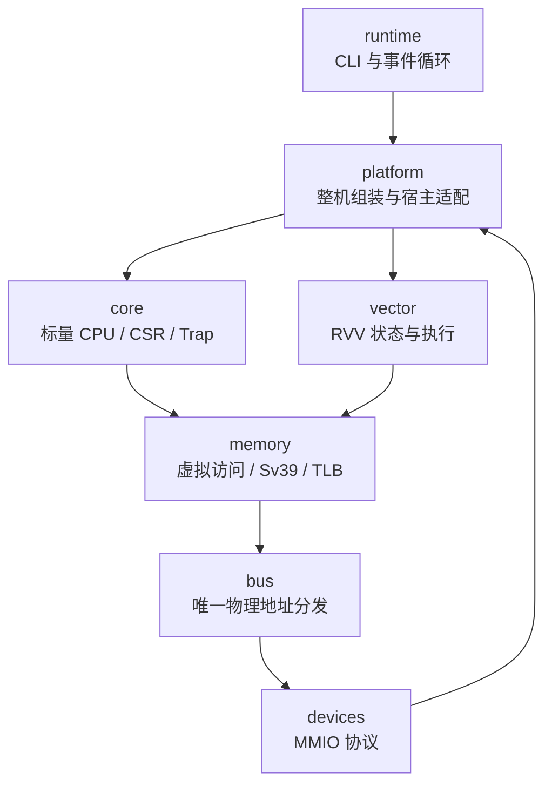
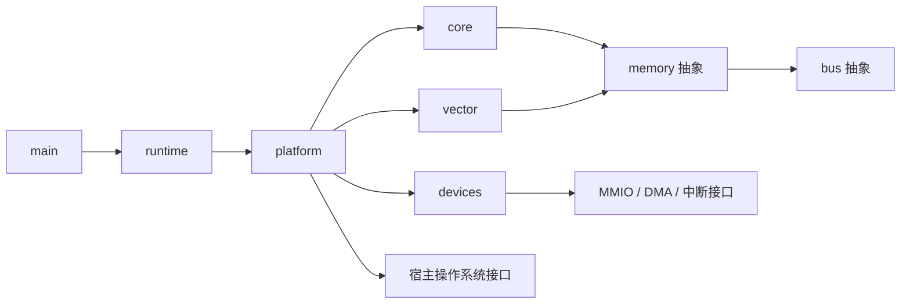

# 目标项目树与职责边界

## 1. 目的

本文定义目标目录结构。目录树是架构边界的物理表达，用于阻止重复实现、循环依赖和职责漂移。当前 SDD 阶段只创建规格文档，下面的代码目录均为后续规划，不代表已经存在。

## 2. 目标目录树

```text
./
├── AGENTS.md
├── CMakeLists.txt
├── README.md
├── .gitignore
├── cmake/
│   └── CompilerWarnings.cmake
├── include/rvemu/
│   ├── core/
│   │   ├── cpu.hpp
│   │   ├── cpu_state.hpp
│   │   ├── csr.hpp
│   │   ├── decoder.hpp
│   │   ├── integer_a.hpp
│   │   ├── integer_m.hpp
│   │   ├── instruction.hpp
│   │   └── trap.hpp
│   ├── vector/
│   │   ├── vector_state.hpp
│   │   ├── vector_decoder.hpp
│   │   └── vector_executor.hpp
│   ├── memory/
│   │   ├── access.hpp
│   │   ├── mmu.hpp
│   │   ├── sv39.hpp
│   │   ├── tlb.hpp
│   │   └── physical_memory.hpp
│   ├── bus/
│   │   ├── bus.hpp
│   │   ├── address_map.hpp
│   │   └── mmio_device.hpp
│   ├── devices/
│   │   ├── clint.hpp
│   │   ├── plic.hpp
│   │   ├── uart16550.hpp
│   │   ├── virtio_mmio.hpp
│   │   ├── virtqueue.hpp
│   │   ├── virtio_block.hpp
│   │   └── virtio_net.hpp
│   ├── platform/
│   │   ├── machine.hpp
│   │   ├── boot_loader.hpp
│   │   ├── fdt_builder.hpp
│   │   ├── tap_backend.hpp
│   │   ├── disk_backend.hpp
│   │   └── terminal.hpp
│   └── runtime/
│       ├── cli.hpp
│       ├── event_loop.hpp
│       └── diagnostics.hpp
├── src/
│   ├── main.cpp
│   ├── core/
│   ├── vector/
│   ├── memory/
│   ├── bus/
│   ├── devices/
│   ├── platform/
│   └── runtime/
├── tests/
│   ├── unit/
│   ├── integration/
│   ├── conformance/
│   ├── system/
│   ├── fixtures/
│   └── README.md
├── tools/
│   ├── fetch/
│   ├── build-images/
│   └── host-network/
├── configs/
│   └── default-machine.toml
├── specs/
│   └── ...
├── docs-site/
│   ├── mkdocs.yml
│   ├── requirements.lock
│   ├── README.md
│   ├── specs/
│   │   ├── mkdocs_prd.zh.md
│   │   └── github_action_prd.zh.md
│   ├── docs/
│   │   ├── zh/             # 指向中文权威 Markdown 的相对 symlink
│   │   └── en/             # 指向英文权威 Markdown 的相对 symlink
│   ├── overrides/
│   └── assets/
├── .github/
│   └── workflows/
│       └── docs-pages.yml
├── docs/
│   ├── build.md
│   ├── running.md
│   └── troubleshooting.md
└── artifacts/                 # 本地外部/构建产物，禁止提交
    ├── downloads/
    ├── firmware/
    ├── kernel/
    ├── rootfs/
    ├── disk/
    └── logs/
```

## 3. 核心职责



### 3.1 `core`

负责标量 CPU 状态、CSR、特权态、标量指令译码执行、陷阱入口/返回以及 LR/SC token 生命周期。它不负责物理地址路由、宿主文件或终端操作。

### 3.2 `vector`

负责 RVV 1.0 状态、向量译码和执行。向量访存通过 `memory` 暴露的统一访问接口完成，不直接触碰 RAM。

### 3.3 `memory`

负责虚拟访问语义、Sv39 页表漫游、TLB、访问权限和物理内存存储。页表读取和最终访问都经 `bus`，但必须区分“页表物理访问”和“来宾虚拟访问”，防止递归翻译。

### 3.4 `bus`

负责唯一的物理地址分发和单 Hart 物理保留监视。RAM、ROM 和每个 MMIO 设备都注册不重叠区间。总线不解释指令，也不处理虚拟地址。

### 3.5 `devices`

负责来宾可见硬件协议。VirtIO 公共层只实现传输和队列规则，块设备与网卡共享它，不复制描述符解析逻辑。

### 3.6 `platform`

负责组装整机以及宿主资源适配：镜像文件、TAP、终端、FDT 和启动镜像加载。宿主后端不能改变来宾硬件语义。

### 3.7 `runtime`

负责 CLI、事件循环、诊断和受控退出。它编排机器，不实现 CPU 指令或设备寄存器。

## 4. 依赖方向

允许的主要依赖方向为：



禁止设备反向调用 CPU 私有状态，禁止 CPU 根据具体设备类型分支，禁止测试复制生产译码器。

## 5. 单一实现约束

以下能力在项目中只能各有一个权威入口：

- 指令长度判定与译码分发。
- CSR 合法性和读改写规则。
- 虚拟内存权限检查。
- 物理地址总线分发。
- 陷阱选择、委托与入口状态更新。
- Virtqueue 描述符链遍历和边界检查。
- PLIC 中断源状态更新。

测试辅助代码只能构造输入和断言输出，不能重新实现这些规则。

## 6. 外部产物目录

`artifacts/` 只保存本地下载、构建、运行日志和镜像。该目录必须由 `.gitignore` 排除；仓库内只提交可复现脚本、校验清单和文档。实际目录及忽略规则在实施阶段另行确认后创建。

## 7. 文档站目录

`docs-site/` 是独立 MkDocs 工程。其 `docs/zh/` 与 `docs/en/` 只保存相对 symlink，分别指向仓库中的中文和英文权威 Markdown；禁止复制规格正文形成第二套来源。`.github/workflows/docs-pages.yml` 是 GitHub 平台要求的唯一站点目录外工作流文件。
