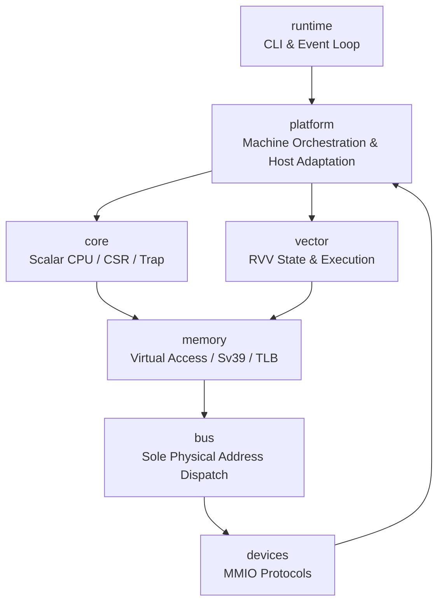
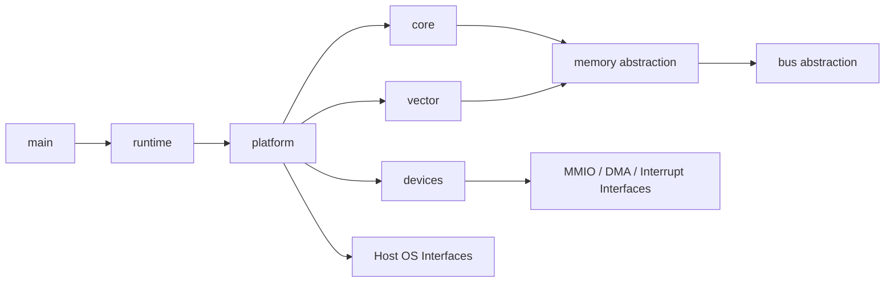

# Target Project Tree & Responsibility Boundaries

## 1. Purpose

This document defines the target directory structure. The directory tree is the physical expression of architectural boundaries, used to prevent duplicate implementations, circular dependencies, and scope drift. Implemented nodes sync with actual files, while un-implemented nodes express final target states.

## 2. Target Directory Tree

```text
./
├── AGENTS.md
├── CMakeLists.txt
├── README.md
├── .gitignore
├── cmake/
│   └── CompilerWarnings.cmake
├── include/rvemu/
│   ├── core/
│   │   ├── cpu.hpp
│   │   ├── cpu_state.hpp
│   │   ├── compressed_decoder.hpp
│   │   ├── csr.hpp
│   │   ├── decoder.hpp
│   │   ├── floating_state.hpp
│   │   ├── soft_float.hpp
│   │   ├── integer_a.hpp
│   │   ├── integer_m.hpp
│   │   ├── instruction.hpp
│   │   └── trap.hpp
│   ├── vector/
│   │   ├── vector_state.hpp
│   │   ├── vector_decoder.hpp
│   │   └── vector_executor.hpp
│   ├── memory/
│   │   ├── access.hpp
│   │   ├── mmu.hpp
│   │   ├── sv39.hpp
│   │   ├── tlb.hpp
│   │   └── physical_memory.hpp
│   ├── bus/
│   │   ├── bus.hpp
│   │   ├── address_map.hpp
│   │   └── mmio_device.hpp
│   ├── devices/
│   │   ├── clint.hpp
│   │   ├── plic.hpp
│   │   ├── uart16550.hpp
│   │   ├── virtio_mmio.hpp
│   │   ├── virtqueue.hpp
│   │   ├── virtio_block.hpp
│   │   └── virtio_net.hpp
│   ├── platform/
│   │   ├── machine.hpp
│   │   ├── boot_loader.hpp
│   │   ├── fdt_builder.hpp
│   │   ├── tap_backend.hpp
│   │   ├── disk_backend.hpp
│   │   └── terminal.hpp
│   └── runtime/
│       ├── cli.hpp
│       ├── event_loop.hpp
│       └── diagnostics.hpp
├── src/
│   ├── main.cpp
│   ├── core/
│   │   ├── compressed_decoder.cpp
│   │   ├── cpu_floating.cpp
│   │   ├── soft_float_internal.hpp
│   │   ├── soft_float_arithmetic.cpp
│   │   └── soft_float_conversion.cpp
│   ├── vector/
│   ├── memory/
│   ├── bus/
│   ├── devices/
│   ├── platform/
│   └── runtime/
├── tests/
│   ├── unit/
│   ├── integration/
│   ├── conformance/
│   ├── system/
│   ├── fixtures/
│   └── README.md
├── tools/
│   ├── fetch/
│   ├── build-images/
│   └── host-network/
├── configs/
│   └── default-machine.toml
├── specs/
│   └── ...
├── docs-site/
│   ├── mkdocs.yml
│   ├── requirements.lock
│   ├── README.md
│   ├── specs/
│   │   ├── mkdocs_prd.zh.md
│   │   └── github_action_prd.zh.md
│   ├── docs/
│   │   ├── zh/             # Relative symlinks pointing to Chinese source Markdown files
│   │   └── en/             # Relative symlinks pointing to English source Markdown files
│   ├── overrides/
│   └── assets/
├── .github/
│   └── workflows/
│       └── docs-pages.yml
├── docs/
│   ├── build.md
│   ├── running.md
│   └── troubleshooting.md
└── artifacts/                 # Local external/build artifacts, prohibited from Git tracking
    ├── downloads/
    ├── firmware/
    ├── kernel/
    ├── rootfs/
    ├── disk/
    └── logs/
```

## 3. Core Responsibilities



### 3.1 `core`

Responsible for scalar CPU state, CSRs, privilege modes, scalar instruction decoding/execution, trap entries/returns, and LR/SC token lifecycles. It is not responsible for physical address routing, host files, or terminal operations.

### 3.2 `vector`

Responsible for RVV 1.0 state, vector decoding, and execution. Vector memory accesses complete via unified access interfaces exposed by `memory`, without directly touching RAM.

### 3.3 `memory`

Responsible for virtual access semantics, Sv39 page table walks, TLB, access permissions, and physical memory storage. Page table reads and final accesses both pass through `bus`, but must distinguish "page table physical access" from "guest virtual access" to prevent recursive translations.

### 3.4 `bus`

Responsible for sole physical address dispatch and single-hart physical reservation monitoring. RAM, ROM, and every MMIO device register non-overlapping intervals. The bus does not decode instructions nor handle virtual addresses.

### 3.5 `devices`

Responsible for guest-visible hardware protocols. VirtIO common layer implements transport and queue rules only; block device and network card share it without duplicating descriptor parsing logic.

### 3.6 `platform`

Responsible for assembling the full machine and host resource adaptation: image files, TAP, terminal, FDT, and boot image loading. Host backends cannot alter guest hardware semantics.

### 3.7 `runtime`

Responsible for CLI, event loop, diagnostics, and controlled exits. It orchestrates the machine, executing no CPU instructions or device registers directly.

## 4. Dependency Directions

Permitted primary dependency directions:



Device reverse calls to CPU private states, CPU branching per specific device type, and test suites duplicating production decoders are prohibited.

## 5. Single Implementation Constraints

The following capabilities must maintain exactly one authoritative entry point in the project:

- Instruction length evaluation and decoding dispatch.
- CSR validity and read-modify-write rules.
- Virtual memory permission checks.
- Physical address bus dispatch.
- Trap selection, delegation, and entry state updates.
- Virtqueue descriptor chain traversals and bounds checks.
- PLIC interrupt source state updates.

Test helper code constructs inputs and asserts outputs only, and cannot re-implement these rules.

## 6. External Artifact Directory

`artifacts/` saves local downloads, builds, runtime logs, and images only. This directory must be excluded by `.gitignore`; repository commits reproducible scripts, checksum manifests, and documentation only. Actual directory and ignore rules are created after separate confirmation during implementation.

## 7. Documentation Site Directory

`docs-site/` is an independent MkDocs project. Its `docs/zh/` and `docs/en/` store relative symlinks only, pointing to Chinese and English authoritative Markdown files in the repository respectively; duplicating specification body text to form a secondary source of truth is prohibited. `.github/workflows/docs-pages.yml` is the sole workflow file outside the site directory required by GitHub Platform.
